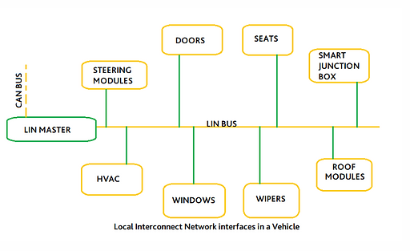

# Interrupt - Timer
Ngắt là một sự kiện khẩn cấp xảy ra bên trong hoặc bên ngoài vi điều khiển, yêu cầu dừng chương trình chính để thực thi chương trình xử lý ngắt.
Các loại ngắt thông dụng:
Bao gồm ngắt Reset, ngắt ngoài, ngắt Timer1, và ngắt truyền thông. 
### Hàm phục vụ ngắt :
Mỗi ngắt có địa chỉ trình phục vụ ngắt riêng trong bộ nhớ, được gọi là vector ngắt.
Ngắt ngoài:
Xảy ra khi có thay đổi điện áp trên các chân GPIO được cấu hình làm ngõ vào ngắt. Các kiểu kích hoạt ngắt gồm LOW, HIGH, Rising, và Falling.
### Ngắt Timer:
Xảy ra khi giá trị trong thanh ghi đếm của timer bị tràn. Sau mỗi lần tràn, cần phải reset giá trị thanh ghi để có thể tạo ngắt tiếp theo.
Ngắt truyền thông:
Xảy ra khi có sự kiện truyền/nhận dữ liệu giữa MCU và các thiết bị khác, thường sử dụng cho các giao thức như UART, SPI, I2C.
Độ ưu tiên ngắt:
Các ngắt có độ ưu tiên khác nhau, quyết định ngắt nào được thực thi khi nhiều ngắt xảy ra đồng thời. Trên STM32, ngắt có số ưu tiên càng thấp thì có quyền càng cao.
Giải thích về cơ chế hoạt động của chương trình (Thanh Ghi PC) khi xảy ra ngắt lồng nhau.
### Timer:
Timer là mạch digital logic dùng để đếm các chu kỳ clock, có thể hoạt động ở chế độ nhận xung clock từ tín hiệu ngoài. 
Timer trong Stm32F1: 
### Cấu hình Timer:
Các thông số như Prescaler, Period, và Clock Division được cấu hình để điều chỉnh cách thức đếm của Timer.
Ví dụ cấu hình timer với thư viện STD.
Ví dụ: Hàm delay_ms:
Được thiết kế để tạo ra khoảng trễ chính xác bằng cách sử dụng Timer. Với cài đặt cụ thể, Timer sẽ đếm lên mỗi 0.1ms và lặp lại số lần cần thiết để tạo độ trễ.
Cung cấp kiến thức cơ bản và hướng dẫn cấu hình ngắt và Timer trên vi điều khiển.
# Lý thuyết các chuẩn giao tiếp cơ bản
## SPI
### SPI – Serial Peripheral Interface – hay còn gọi là giao diện ngoại vi nối tiếp, được phát triển bởi hãng Motorola. 
Chuẩn đồng bộ nối truyền dữ liệu ở chế độ full - duplex (hay gọi là "song công toàn phần". Nghĩa là tại 1 thời điểm có thể xảy ra đồng thời quá trình truyền và nhận. Là giao tiếp đồng bộ, bất cứ quá trình nào cũng đều được đồng bộ với xung clock sinh ra bởi thiết bị Master  
Tốc độ truyền thông cao: SPI cho phép truyền dữ liệu với tốc độ rất nhanh, thường đạt được tốc độ Mbps hoặc thậm chí hàng chục Mbps. Điều này rất hữu ích khi cần truyền dữ liệu nhanh và đáng tin cậy trong các ứng dụng như truyền thông không dây, điều khiển từ xa và truyền dữ liệu đa phương tiện.

### SPI sử dụng 4 đường giao tiếp nên đôi khi được gọi là chuẩn truyền thông “ 4 dây”:
- SCK (Serial Clock): Thiết bị Master tạo xung tín hiệu SCK và cung cấp cho Slave. Xung này có chức năng giữ nhịp cho giao tiếp SPI. Mỗi nhịp trên chân SCK báo 1 bit dữ liệu đến hoặc đi → Quá trình ít bị lỗi và tốc độ truyền cao.
- MISO (Master Input Slave Output): Tín hiệu tạo bởi thiết bị Slave và nhận bởi thiết bị Master. Đường MISO phải được kết nối giữa thiết bị Master và Slave.
- MOSI (Master Output Slave Input): Tín hiệu tạo bởi thiết bị Master và nhận bởi thiết bị Slave. Đường MOSI phải được kết nối giữa thiết bị Master và Slave.
- SS (Slave Select): Chọn thiết bị Slave cụ thể để giao tiếp. Để chọn Slave giao tiếp thiết bị Master chủ động kéo đường SS tương ứng xuống mức 0 (Low). Chân này đôi khi còn được gọi là CS (Chip Select). Chân SS của vi điều khiển (Master) có thể được người dùng tạo bằng cách cấu hình 1 chân GPIO bất kỳ chế độ Output.
  
    SPI cho phép 1 MCU chủ giao tiếp với nhiều thiết bị tớ thông qua tín hiệu chọn thiết bị SS. Các thiết bị tớ chỉ có thể có 1 chân CS để nhận tín hiệu chọn này, tuy nhiên thiết bị chủ có thể có nhiều hơn 1 chân SS để chọn từng thiết bị muốn giao tiếp.


### Khung truyền SPI:
- Mỗi chip Master hay Slave đều có một thanh ghi dữ liệu 8 bits. Quá trình truyền nhận giữa Master và Slave xảy ra đồng thời theo chu kỳ clock ở chân CLK, một byte dữ liệu được truyền theo cả 2 hướng 
- Quá trình trao đổi dữ liệu bắt đầu khi Master tạo 1 xung clock từ bộ tạo xung nhịp (Clock Generator) và kéo đường SS của Slave mà nó truyền dữ liệu xuống mức Low. Mỗi xung clock, Master sẽ gửi đi 1 bit từ thanh ghi dịch (Shift Register) của nó đến thanh ghi dịch của Slave thông qua đường MOSI. Đồng thời Slave cũng gửi lại 1 bit đến cho Master qua đường MISO.Như vậy sau 8 chu kỳ clock thì hoàn tất việc truyền và nhận 1 byte dữ liệu.
- Trong giao tiếp SPI, chỉ có thể có 1 Master nhưng có thể 1 hoặc nhiều Slave cùng lúc. Ở trạng thái nghỉ, chân SS của các Slave ở mức 1, muốn giao tiếp với Slave nào thì ta chỉ việc kéo chân SS của Slave đó xuống mức 0.

### Chế độ hoạt động: 
    SPI có 4 chế độ hoạt động phụ thuộc vào cực của xung giữ (Clock Polarity – CPOL) và pha (Phase - CPHA). CPOL dùng để chỉ trạng thái của chân SCK ở trạng thái nghỉ. Chân SCK giữ ở mức cao khi CPOL=1 hoặc mức thấp khi CPOL=0. CPHA dùng để chỉ các mà dữ liệu được lấy mẫu theo xung. Dữ liệu sẽ được lấy ở cạnh lên của SCK khi CPHA=0 hoặc cạnh xuống khi CPHA=1.

- Mode 0 (mặc định) – xung nhịp của đồng hồ ở mức thấp (CPOL = 0) và dữ liệu được lấy mẫu khi chuyển từ thấp sang cao (cạnh lên) (CPHA = 0). 
- Mode 1 - xung nhịp của đồng hồ ở mức thấp (CPOL = 0) và dữ liệu được lấy mẫu khi chuyển từ cao sang thấp (cạnh xuống) (CPHA = 1).
- Mode 2 - xung nhịp của đồng hồ ở mức cao (CPOL = 1) và dữ liệu được lấy mẫu khi chuyển từ cao sang thấp (cạnh lên) (CPHA = 0).
- Mode 3 - xung nhịp của đồng hồ ở mức cao (CPOL = 1) và dữ liệu được lấy mẫu khi chuyển từ thấp sang cao (cạnh xuông) (CPHA = 1).

## UART

    UART (Universal Asynchronous Receiver-Transmitter – Bộ truyền nhận dữ liệu không đồng bộ) là một giao thức truyền thông phần cứng dùng giao tiếp nối tiếp không đồng bộ và có thể cấu hình được tốc độ
    Giao thức UART là một giao thức đơn giản và phổ biến, bao gồm hai đường truyền dữ liệu độc lập là TX (truyền) và RX (nhận). Dữ liệu được truyền và nhận qua các đường truyền này dưới dạng các khung dữ liệu (data frame) có cấu trúc chuẩn, với một bit bắt đầu (start bit), một số bit dữ liệu (data bits), một bit kiểm tra chẵn lẻ (parity bit) và một hoặc nhiều bit dừng (stop bit).

    Thông thường, tốc độ truyền của UART được đặt ở một số chuẩn, chẳng hạn như 9600, 19200, 38400, 57600, 115200 baud và các tốc độ khác. Tốc độ truyền này định nghĩa số lượng bit được truyền qua mỗi giây. Các tốc độ truyền khác nhau thường được sử dụng tùy thuộc vào ứng dụng và hệ thống sử dụng.
Uart truyền dữ liệu nối tiếp, theo 1 trong 3 chế độ:
- Simplex: Chỉ tiến hành giao tiếp một chiều
- Half duplex: Dữ liệu sẽ đi theo một hướng tại 1 thời điểm
- Full duplex: Thực hiện giao tiếp đồng thời đến và đi từ mỗi master và slave
    Chân Tx (truyền) của một chip sẽ kết nối trực tiếp với chân Rx (nhận) của chip khác và ngược lại. Quá trình truyền dữ liệu thường sẽ diễn ra ở 3.3V hoặc 5V. Uart là một giao thức giao tiếp giữa một master và một slave. Trong đó 1 thiết bị được thiết lập để tiến hành giao tiếp với chỉ duy nhất 1 thiết bị khác.
    Dữ liệu truyền đến và đi từ Uart song song với thiết bị điều khiển. Khi tín hiệu gửi trên chân Tx (truyền), bộ giao tiếp Uart đầu tiên sẽ dịch thông tin song song này thành dạng nối tiếp và sau đó truyền tới thiết bị nhận. Chân Rx (nhận) của Uart thứ 2 sẽ biến đổi nó trở lại thành dạng song song để giao tiếp với các thiết bị điều khiển.
Dữ liệu truyền qua Uart sẽ đóng thành các gói (packet). Mỗi gói dữ liệu chứa 1 bit bắt đầu, 5 – 9 bit dữ liệu (tùy thuộc vào bộ Uart), 1 bit chẵn lẻ tùy chọn và 1 bit hoặc 2 bit dừng.

    Quá trình truyền dữ liệu Uart sẽ diễn ra dưới dạng các gói dữ liệu này, bắt đầu bằng 1 bit bắt đầu, đường mức cao được kéo dần xuống thấp. Sau bit bắt đầu là 5 – 9 bit dữ liệu truyền trong khung dữ liệu của gói, theo sau là bit chẵn lẻ tùy chọn để nhằm xác minh việc truyền dữ liệu thích hợp. Sau cùng, 1 hoặc nhiều bit dừng sẽ được truyền ở nơi đường đặt tại mức cao. Vậy là sẽ kết thúc việc truyền đi một gói dữ liệu
  
##  I2C.

I2C kết hợp các tính năng tốt nhất của SPI và UART. Giống như giao tiếp UART, I2C chỉ sử dụng hai dây để truyền dữ liệu giữa các thiết bị:
- SDA (Serial Data) - đường truyền cho master và slave để gửi và nhận dữ liệu.
- SCL (Serial Clock) - đường mang tín hiệu xung nhịp.
- I2C là một giao thức truyền thông nối tiếp, vì vậy dữ liệu được truyền từng bit dọc theo một đường duy nhất (đường SDA).
 Giống như SPI, I2C là đồng bộ, do đó đầu ra của các bit được đồng bộ hóa với việc lấy mẫu các bit bởi một tín hiệu xung nhịp được chia sẻ giữa master và slave. Tín hiệu xung nhịp luôn được điều khiển bởi master.
Với I2C, dữ liệu được truyền trong các tin nhắn. Tin nhắn được chia thành các khung dữ liệu. Mỗi tin nhắn có một khung địa chỉ chứa địa chỉ nhị phân của địa chỉ slave và một hoặc nhiều khung dữ liệu chứa dữ liệu đang được truyền. Thông điệp cũng bao gồm điều kiện khởi động và điều kiện dừng, các bit đọc / ghi và các bit ACK / NACK giữa mỗi khung dữ liệu:

- Điều kiện khởi động: Đường SDA chuyển từ mức điện áp cao xuống mức điện áp thấp trước khi đường SCL chuyển từ mức cao xuống mức thấp.
- Điều kiện dừng: Đường SDA chuyển từ mức điện áp thấp sang mức điện áp cao sau khi đường SCL chuyển từ mức thấp lên mức cao.
- Khung địa chỉ: Một chuỗi 7 hoặc 10 bit duy nhất cho mỗi slave để xác định slave khi master muốn giao tiếp với nó.
- Bit Đọc / Ghi: Một bit duy nhất chỉ định master đang gửi dữ liệu đến slave (mức điện áp thấp) hay yêu cầu dữ liệu từ nó (mức điện áp cao).
- Bit ACK / NACK: Mỗi khung trong một tin nhắn được theo sau bởi một bit xác nhận / không xác nhận. Nếu một khung địa chỉ hoặc khung dữ liệu được nhận thành công, một bit ACK sẽ được trả lại cho thiết bị gửi từ thiết bị nhận.
### Địa chỉ
    I2C không có các đường Slave Select như SPI, vì vậy cần một cách khác để cho slave biết rằng dữ liệu đang được gửi đến slave này chứ không phải slave khác. Nó thực hiện điều này bằng cách định địa chỉ. Khung địa chỉ luôn là khung đầu tiên sau bit khởi động.
    Master gửi địa chỉ của slave mà nó muốn giao tiếp với mọi slave được kết nối với nó. Sau đó, mỗi slave sẽ so sánh địa chỉ được gửi từ master với địa chỉ của chính nó. Nếu địa chỉ phù hợp, nó sẽ gửi lại một bit ACK điện áp thấp cho master. Nếu địa chỉ không khớp, slave không làm gì cả và đường SDA vẫn ở mức cao.
### Bit đọc / ghi
    Khung địa chỉ bao gồm một bit duy nhất ở cuối tin nhắn cho slave biết master muốn ghi dữ liệu vào nó hay nhận dữ liệu từ nó. Nếu master muốn gửi dữ liệu đến slave, bit đọc / ghi ở mức điện áp thấp. Nếu master đang yêu cầu dữ liệu từ slave, thì bit ở mức điện áp cao.
### Khung dữ liệu
    Sau khi master phát hiện bit ACK từ slave, khung dữ liệu đầu tiên đã sẵn sàng được gửi.
    Khung dữ liệu luôn có độ dài 8 bit và được gửi với bit quan trọng nhất trước. Mỗi khung dữ liệu ngay sau đó là một bit ACK / NACK để xác minh rằng khung đã được nhận thành công. Bit ACK phải được nhận bởi master hoặc slave (tùy thuộc vào cái nào đang gửi dữ liệu) trước khi khung dữ liệu tiếp theo có thể được gửi.
 
Sau khi tất cả các khung dữ liệu đã được gửi, master có thể gửi một điều kiện dừng cho slave để tạm dừng quá trình truyền. Điều kiện dừng là sự chuyển đổi điện áp từ thấp lên cao trên đường SDA sau khi chuyển tiếp từ thấp lên cao trên đường SCL , với đường SCL vẫn ở mức cao.
 
## Các bước truyền dữ liệu I2C
1. Master gửi điều kiện khởi động đến mọi slave được kết nối bằng cách chuyển đường SDA từ mức điện áp cao sang mức điện áp thấp trước khi chuyển đường SCL từ mức cao xuống mức thấp.
2. Master gửi cho mỗi slave địa chỉ 7 hoặc 10 bit của slave mà nó muốn giao tiếp, cùng với bit đọc / ghi.
3. Mỗi slave sẽ so sánh địa chỉ được gửi từ master với địa chỉ của chính nó. Nếu địa chỉ trùng khớp, slave sẽ trả về một bit ACK bằng cách kéo dòng SDA xuống thấp cho một bit. Nếu địa chỉ từ master không khớp với địa chỉ của slave, slave rời khỏi đường SDA cao.
4. Master gửi hoặc nhận khung dữ liệu.
5. Sau khi mỗi khung dữ liệu được chuyển, thiết bị nhận trả về một bit ACK khác cho thiết bị gửi để xác nhận đã nhận thành công khung.
6. Để dừng truyền dữ liệu, master gửi điều kiện dừng đến slave bằng cách chuyển đổi mức cao SCL trước khi chuyển mức cao SDA.

### Một master với nhiều slave
    Vì I2C sử dụng định địa chỉ nên nhiều slave có thể được điều khiển từ một master duy nhất. Với địa chỉ 7 bit sẽ có 128 (2 mũ 7) địa chỉ duy nhất. Việc sử dụng địa chỉ 10 bit không phổ biến, nhưng nó cung cấp 1.024 (2 mũ 10) địa chỉ duy nhất.

### Nhiều master với nhiều slave
    Nhiều master có thể được kết nối với một slave hoặc nhiều slave. Sự cố với nhiều master trong cùng một hệ thống xảy ra khi hai master cố gắng gửi hoặc nhận dữ liệu cùng một lúc qua đường SDA. Để giải quyết vấn đề này, mỗi master cần phải phát hiện xem đường SDA thấp hay cao trước khi truyền tin nhắn. Nếu đường SDA thấp, điều này có nghĩa là một master khác có quyền điều khiển bus và master đó phải đợi để gửi tin nhắn. Nếu đường SDA cao thì có thể truyền tin nhắn an toàn. Để kết nối nhiều master với nhiều slave.
# SPI Software & SPI Hardware 
## SPI Software
  Trên mỗi dòng vi điều khiển khác nhau module SPI sẽ được tích hợp, điều khiển bởi các thanh ghi,phần cứng, IO khác nhau, đấy gọi là SPI cứng (hardware SPI). Như vậy bản chất chuẩn truyền thông SPI giống nhau trên mỗi chip nhưng lại được cài đặt và sử dụng không giống nhau. Điều này gây thêm khó khăn cho người sử dụng khi bạn bắt đầu tìm hiểu một dòng vi điều khiển mới, bạn sẽ phải nhớ các chân MISO, SS, MOSI, SCK mỗi chip khác nhau, nhớ các thanh ghi, các chế độ hoạt động và cách cài đặt trên các dòng vi điều khiển khác nhau. 
  Để khắc phục nhược điểm trên, có 1 cách lập trình giả lập SPI cứng đó là “SPI mềm”. Thực chất SPI mềm là cách “mô phỏng” bằng cách tạo ra một giao thức truyền thông giống SPI nhưng chỉ sử dụng các cổng vào ra của vi điều khiển. Như vậy chỉ với việc điều khiển GPIO của chip hoàn toàn có thể thực hiện giao thức SPI. 
Điều này cũng có nghĩa là có thể sử dụng giao thức này trên bất kì vi điều khiển nào mà không cần phải nhớ thanh ghi hay các chân phần cứng.
### 1.1 Cấu hình GPIO cho SPI mềm.
  SPI dùng 4 chân để truyền nhận, gồm MISO, MOSI, CS và SCK.
   
- MISO: (Master In Slave Out) Chân nhận tín hiệu của Master nối với chân truyền của Slave, vì vậy được cấu hình Input ở Master và Output ở Slave.
- MOSI: (Master Out SLave In) Ngược lại với MISO, cấu hình Input cho Slave và Output cho Master.
- SCK: (Clock) Chân truyền tín hiệu xung đồng bộ từ Master cho Slave, được cấu hình Output cho Master và Input cho Slave.
- CS: (Chip Select) Chân gửi tín hiệu chọn Slave của Master tới các Slave. Cấu hình Output cho Master và Input cho Slave. Có thể có nhiều CS để Master điều khiển nhiều Slave.
  Bước đầu, ta định nghĩa cho 4 chân sử dụng cho SPI:
```
#define SPI_MISO_Pin GPIO_Pin_1
#define SPI_MOSI_Pin GPIO_Pin_2
#define SPI_CS_Pin GPIO_Pin_3
#define SPI_GPIO GPIOA
#define SPI_RCC RCC_APB2Periph_GPIOA
```
Tạo hàm khởi tạo cho SPI:
``` 
void SPI_Init(){
GPIO_WriteBit(SPI_PORT, SPI_SCK, 0);
GPIO_WriteBit(SPI_PORT, SPI_CS, 1);
GPIO_WriteBit(SPI_PORT, SPI_MISO, 0);
GPIO_WriteBit(SPI_PORT, SPI_MOSI, 0);
}
```
Hàm SPI_Init khởi tạo các giá trị cho các chân khi chưa có sự kiện truyền nhận.
- SCK = 0: Clock sẽ ở mức thấp, tùy vào cấu hình CPHA, CPOL mà giá trị này có thể sẽ khác. Ở đây ta mô phỏng đơn giản, khi clock ở mức 1 sẽ lấu mẫu dữ liệu, mức 0 sẽ là chế độ nghỉ.
- CS = 1: Khi Master chưa truyền nhận, CS ở mức 1 cho tất cả các Slave.
- Các chân MISO, MOSI được kéo về 0 ở chế độ nghỉ.
 ### 1.2 SPI software code cho master
   Clock sẽ được tạo bằng hàm delay kết hợp với set/reset tín hiệu trên đường SCK:
```
void Clock()
{
	GPIO_WriteBit(SPI_PORT, SPI_SCK, 1);
	delay(1000);
	GPIO_WriteBit(SPI_PORT, SPI_SCK, 0);
	delay(1000);
}
```
Mỗi khi hàm Clock được gọi, sẽ tạo 1 xung vuông, tín hiệu sẽ được truyền nhận theo clock này.
 
	Hàm truyền ở master:
```
void SPI_Master_Transmit(uint8_t u8Data){
	uint8_t u8Mask = 0x80;
	uint8_t tempData;
	GPIO_WriteBit(SPI_GPIO, SPI_CS_Pin, Bit_RESET);
	delay(10);
	for(int i=0; i<8; i++){
		tempData = u8Data & u8Mask;
		if(tempData){
			GPIO_WriteBit(SPI_GPIO, SPI_MOSI_Pin, Bit_SET);
			delay(10);
		} else{
			GPIO_WriteBit(SPI_GPIO, SPI_MOSI_Pin, Bit_RESET);
			delay(10);
		}
		u8Data<<=1;
		Clock();
	}
	GPIO_WriteBit(SPI_GPIO, SPI_CS_Pin, Bit_SET);
	delay(10);
}
```
Mô phỏng quá trình truyền nhận:
```
	while(1)
		{	
			for(int i=0; i<7; i++){
			SPI_Master_Transmit(DataTrans[i]);
			delay(5000000);
			}
		}
```
Các byte trong 1 chuỗi DataTrans sẽ được truyền lần lượt bằng hàm SPI_Master_Transmit.
```
uint8_t SPI_SlaveReceive()
{
  uint8_t i = 0;  uint8_t dataReceive=0x00;bool st=0;
  while (digitalRead(SS));
  while (!digitalRead(SCK));
    for(i=0; i<8;i++)
    { if(digitalRead(SCK)){
      while (digitalRead(SCK)) st = digitalRead(MISO);
      dataReceive=dataReceive<<1;
      dataReceive=dataReceive|st;
    }
    while (!digitalRead(SCK));
    }
  return dataReceive;
}
///in main loop
void loop(){
  if(!(digitalRead(SS))){
    dat=SPI_SlaveReceive();
    Serial.println(dat,DEC);
  }
}
```
Ở slave sẽ dựa vào tín hiệu CS và SCK để xác định lệnh truyền nhận từ Master cũng như thời diểm đọc dữ liệu.
## SPI Hardware
STM32F1 có 2 khối SPI, SPI1 ở APB2 và SPI2 ở PAB1. Các khối này được xây dựng các kết nối, driver và các hàm riêng trong bộ thư viện chuẩn.
### 2.1 Cấu hình GPIO cho SPI.
	STM32 cấu hình sẵn các chân dành cho chức năng SPI. 
 
	Ở đây, ví dụ sử dụng SPI1, các chân đã được thiết lập sẵn. Ta sẽ cấu hình cho các chân này. Đầu tiên define các chân với các tên riêng biệt:
```
#define SPI1_NSS 	GPIO_Pin_4
#define SPI1_SCK	GPIO_Pin_5
#define SPI1_MISO 	GPIO_Pin_6
#define SPI1_MOSI 	GPIO_Pin_7
#define SPI1_GPIO 	GPIOA
```
Hàm GPIO config cấu hình các chân của SPI theo từng mode khác nhau:
```
void GPIO_Cofig(){
	GPIO_InitTypeDef GPIO_InitStructure;
	
	GPIO_InitStructure.GPIO_Pin = SPI1_NSS| SPI1_SCK| SPI1_MISO| SPI1_MOSI;
	GPIO_InitStructure.GPIO_Speed = GPIO_Speed_50MHz;
	GPIO_InitStructure.GPIO_Mode = GPIO_Mode_AF_PP;
	GPIO_Init(SPI1_GPIO, &GPIO_InitStructure);
}
```
### 2.2 Cấu hình SPI.
Tương tự các ngoại vi khác, các tham số SPI được cấu hình trong Struct SPI_InitTypeDef:
- SPI_Mode: Quy định chế độ hoạt động của thiết bị SPI. 
- SPI_Direction: Quy định kiểu truyền của thiết bị.
- SPI_BaudRatePrescaler: Hệ số chia clock cấp cho Module SPI.
- SPI_CPOL: Cấu hình cực tính của SCK . Có 2 chế độ:
    - SPI_CPOL_Low: Cực tính mức 0 khi SCK không truyền xung.
    - SPI_CPOL_High: Cực tính mức 1 khi SCK không truyền xung.
- SPI_CPHA: Cấu hình chế độ hoạt động của SCK. Có 2 chế độ:
    - SPI_CPHA_1Edge: Tín hiệu truyền đi ở cạnh xung đầu tiên.
    - SPI_CPHA_2Edge: Tín hiệu truyền đi ở cạnh xung thứ hai.
- SPI_DataSize: Cấu hình số bit truyền. 8 hoặc 16 bit.
- SPI_FirstBit: Cấu hình chiều truyền của các bit là MSB hay LSB.
- SPI_CRCPolynomial: Cấu hình số bit CheckSum cho SPI.
- SPI_NSS: Cấu hình chân SS là điều khiển bằng thiết bị hay phần mềm.
Hàm SPI_Config() cấu hình tham số có SPI:
```
void SPI_Config(){
	SPI_InitTypeDef SPI_InitStructure;
	SPI_InitStructure.SPI_BaudRatePrescaler = SPI_BaudRatePrescaler_32;
	SPI_InitStructure.SPI_CPHA = SPI_CPHA_2Edge;
	SPI_InitStructure.SPI_CPOL = SPI_CPOL_Low;
	SPI_InitStructure.SPI_DataSize = SPI_DataSize_8b;
	SPI_InitStructure.SPI_Direction = SPI_Direction_2Lines_FullDuplex;
	SPI_InitStructure.SPI_FirstBit = SPI_FirstBit_MSB;
	SPI_InitStructure.SPI_Mode = SPI_Mode_Slave;
	SPI_InitStructure.SPI_NSS = SPI_NSS_Soft;
	
	SPI_Init(SPI1, &SPI_InitStructure);
	SPI_Cmd(SPI1, ENABLE);
}
```
- Hàm SPI_I2S_SendData(SPI_TypeDef* SPIx, uint16_t Data), tùy vào cấu hình datasize là 8 hay 16 bit sẽ truyền đi 8 hoặc 16 bit dữ liệu. Hàm nhận 2 tham số là bộ SPI sử dụng và data cần truyền.
- Hàm SPI_I2S_ReceiveData(SPI_TypeDef* SPIx) trả về giá trị đọc được trên SPIx. Hàm trả về 8 hoặc 16 bit data.
- Hàm SPI_I2S_GetFlagStatus(SPI_TypeDef* SPIx, uint16_t SPI_I2S_FLAG) trả về giá trị 1 cờ trong thanh ghi của SPI. Các cờ thường được dùng:
    - SPI_I2S_FLAG_TXE: Cờ báo truyền, cờ này sẽ set lên 1 khi truyền xong data trong buffer.
    - SPI_I2S_FLAG_RXNE: Cờ báo nhận, cờ này set lên 1 khi nhận xong data.
    - SPI_I2S_FLAG_BSY: Cờ báo bận,set lên 1 khi SPI đang bận truyền nhận
      
Các hàm truyền nhận có thể viết nhứ sau:
*Vì cấu hình NSS soft nên khi truyền, ta phải chủ động kéo SS xuống Low bằng phần mềm:
```
void SPI_Send1Byte(uint8_t data){
    GPIO_WriteBit(SPI1_GPIO, SPI1_NSS, Bit_RESET);
   
    SPI_I2S_SendData(SPI1, data);
    while(SPI_I2S_GetFlagStatus(SPI1, SPI_I2S_FLAG_TXE)==0);
   
    GPIO_WriteBit(SPI1_GPIO, SPI1_NSS, Bit_SET);
}

uint8_t SPI_Receive1Byte(void){
    uint8_t temp;
    while(SPI_I2S_GetFlagStatus(SPI1, SPI_I2S_FLAG_BSY)==1);
    temp = (uint8_t)SPI_I2S_ReceiveData(SPI1);
    while(SPI_I2S_GetFlagStatus(SPI1, SPI_I2S_FLAG_RXNE)==0);
    return temp;
}
``` 
# I2C Sofware & I2C Hardware
## I2C Software
Cấu hình GPIO 
 I2C chỉ sử dụng hai dây để truyền dữ liệu giữa các thiết bị:
- SDA (Serial Data) - đường truyền cho master và slave để gửi và nhận dữ liệu.
- SCL (Serial Clock) - đường mang tín hiệu xung nhịp.
 

Các chân có thể vừa là ngõ vào, vừa là ngõ ra tùy thuộc vào Master và slave khi truyền.
```
#define I2C_SCL GPIO_Pin_6
#define I2C_SDA	GPIO_Pin_7
#define I2C_GPIO GPIOB

void RCC_Config(){
    // Bật đồng hồ cho GPIOB (dùng cho các chân I2C SCL và SDA)
    RCC_APB2PeriphClockCmd(RCC_APB2Periph_GPIOB, ENABLE);
    
    // Bật đồng hồ cho TIM2 (dùng cho bộ đếm thời gian, có thể dùng cho I2C hoặc các tác vụ khác)
    RCC_APB1PeriphClockCmd(RCC_APB1Periph_TIM2, ENABLE);
}

void GPIO_Config(){
    GPIO_InitTypeDef GPIO_InitStructure;
    
    // Bật đồng hồ cho GPIOB (cổng này sẽ dùng cho SDA và SCL)
    RCC_APB2PeriphClockCmd(RCC_APB2Periph_GPIOB, ENABLE);

    // Cấu hình các chân GPIO (SDA và SCL) cho giao thức I2C
    GPIO_InitStructure.GPIO_Mode = GPIO_Mode_Out_OD; // Chế độ đầu ra Open-Drain
    GPIO_InitStructure.GPIO_Pin = I2C_SDA | I2C_SCL; // Cấu hình chân SDA và SCL
    GPIO_InitStructure.GPIO_Speed = GPIO_Speed_50MHz; // Cấu hình tốc độ của chân GPIO là 50 MHz
    
    // Khởi tạo các chân GPIOB theo cấu hình đã chỉ định
    GPIO_Init(I2C_GPIO, &GPIO_InitStructure);
}
```
## I2C Software code
 

Ở trạng thái không truyền, các đừng SDA, SCL đều ở mức cao:
```
void I2C_Start(){
    WRITE_SDA_1; // Đảm bảo SDA ở mức cao
    WRITE_SCL_1; // Đảm bảo SCL ở mức cao
    delay_us(1); // Đợi một khoảng ngắn
    
    WRITE_SDA_0; // SDA chuyển xuống mức thấp
    delay_us(1);
    WRITE_SCL_0; // Sau đó kéo SCL xuống mức thấp để bắt đầu truyền
    delay_us(1);
}
```
Massage bắt đầu với 1 tín hiệu start: SDA được kéo xuống 0 trong khi SCL vẫn mức cao
	Các macro dưới đây nhằm mục đích đơn giản hóa việc gọi hàm.
 ```
 // Đặt SDA xuống mức thấp (0) để tạo tín hiệu dữ liệu 0
#define WRITE_SDA_0 	GPIO_ResetBits(I2C_GPIO, I2C_SDA)

// Đặt SDA lên mức cao (1) để tạo tín hiệu dữ liệu 1 hoặc giữ SDA ở trạng thái chờ
#define WRITE_SDA_1 	GPIO_SetBits(I2C_GPIO, I2C_SDA)

// Đặt SCL xuống mức thấp (0) để tạo cạnh xuống cho xung nhịp
#define WRITE_SCL_0 	GPIO_ResetBits(I2C_GPIO, I2C_SCL)

// Đặt SCL lên mức cao (1) để tạo cạnh lên cho xung nhịp hoặc giữ SCL ở trạng thái chờ
#define WRITE_SCL_1 	GPIO_SetBits(I2C_GPIO, I2C_SCL)

// Đọc trạng thái mức logic (0 hoặc 1) từ chân SDA để nhận dữ liệu từ thiết bị khác
#define READ_SDA_VAL 	GPIO_ReadInputDataBit(I2C_GPIO, I2C_SDA)
```
Frame truyền bắt đầu bằng tín hiệu Start, Start: SDA kéo xuống 0 trước SCL 1 khoảng delay nhỏ. Kết thúc bằng tín hiệu stop: SCL kéo lên 1 trước SDA 1 khoảng delay nhỏ.
```
// Hàm tạo tín hiệu START cho giao thức I2C
void I2C_Start(){

	WRITE_SCL_1;  	// Đảm bảo SCL (Clock) ở mức cao để chuẩn bị gửi tín hiệu START.
	delay_us(3);	// Trễ nhỏ để tín hiệu ổn định.

	WRITE_SDA_1;    // Đảm bảo SDA (Data) ở mức cao trước khi tạo cạnh xuống để bắt đầu.
	delay_us(3);	// Trễ nhỏ để tín hiệu ổn định.

	WRITE_SDA_0;	// Kéo SDA xuống mức thấp (0) trong khi SCL vẫn ở mức cao -> tạo tín hiệu START.
	delay_us(3);	// Trễ để đảm bảo Slave nhận biết tín hiệu START.

	WRITE_SCL_0;	// Kéo SCL xuống mức thấp để tiếp tục truyền dữ liệu sau tín hiệu START.
	delay_us(3);	// Trễ nhỏ để tín hiệu ổn định.
}

// Hàm tạo tín hiệu STOP cho giao thức I2C
void I2C_Stop(){

	WRITE_SDA_0;	// Đảm bảo SDA ở mức thấp (0) trước khi tạo tín hiệu dừng.
	delay_us(3);	// Trễ nhỏ để tín hiệu ổn định.

	WRITE_SCL_1; 	// Đặt SCL lên mức cao trước khi đưa SDA lên mức cao -> tạo tín hiệu STOP.
	delay_us(3);	// Trễ nhỏ để tín hiệu ổn định.

	WRITE_SDA_1;	// Kéo SDA lên mức cao (1) khi SCL đang ở mức cao -> tạo tín hiệu STOP.
	delay_us(3);	// Trễ để đảm bảo Slave nhận biết tín hiệu STOP.
}
```
### Hàm truyền: 
Hàm truyền sẽ truyền lần lượt 8 bit trong byte dữ liệu.
	- Truyền 1 bit.
	- Tạo clock;
	- Dịch 1 bit.
- Chờ nhận lại ACK ở xung thứ 9.

```
// Hàm ghi dữ liệu 8-bit vào bus I2C
status I2C_Write(uint8_t u8Data) {	
	uint8_t i;          // Biến đếm vòng lặp.
	status stRet;       // Biến trạng thái trả về (OK hoặc NOT_OK).

	// Vòng lặp để ghi từng bit của byte dữ liệu (8 bit).
	for(int i = 0; i < 8; i++) {		
		// Kiểm tra bit cao nhất (MSB) của dữ liệu.
		if (u8Data & 0x80) {	// Nếu bit này là 1
			WRITE_SDA_1;      // Đặt SDA ở mức cao.
		} else {              // Nếu bit này là 0
			WRITE_SDA_0;      // Đặt SDA ở mức thấp.
		}

		delay_us(3);		// Trễ nhỏ để đảm bảo tín hiệu ổn định.

		WRITE_SCL_1;		// Đưa SCL lên mức cao -> Chốt dữ liệu vào Slave.
		delay_us(5);		// Giữ mức cao để Slave nhận dữ liệu.

		WRITE_SCL_0;		// Đưa SCL xuống mức thấp để chuẩn bị bit tiếp theo.
		delay_us(2);		// Trễ nhỏ để tín hiệu ổn định.

		u8Data <<= 1;		// Dịch trái dữ liệu 1 bit để chuẩn bị gửi bit tiếp theo.
	}

	// Tạo tín hiệu nhận ACK từ Slave.
	WRITE_SDA_1;			// Nhả SDA để chuyển sang chế độ đọc (Input Mode).
	delay_us(3);			// Trễ nhỏ để tín hiệu ổn định.

	WRITE_SCL_1;			// Đưa SCL lên mức cao để Slave gửi ACK.
	delay_us(3);			// Giữ mức cao để chốt trạng thái ACK.

	// Đọc ACK từ Slave.
	if (READ_SDA_VAL) {	    // Nếu SDA vẫn ở mức cao -> không có ACK (NACK).
		stRet = NOT_OK;		// Trả về trạng thái thất bại.
	} else {                // Nếu SDA được kéo xuống thấp -> có ACK.
		stRet = OK;			// Trả về trạng thái thành công.
	}

	delay_us(2);			// Trễ nhỏ để tín hiệu ổn định.
	WRITE_SCL_0;			// Đưa SCL xuống mức thấp để kết thúc quá trình ACK.
	delay_us(5);			// Trễ nhỏ để ổn định tín hiệu trước khi kết thúc.

	return stRet;			// Trả về kết quả quá trình ghi dữ liệu.
}
```
Giải thích chi tiết về hoạt động:
1.Ghi dữ liệu (Write Byte):
- Vòng lặp chạy 8 lần, mỗi lần xử lý 1 bit từ dữ liệu đầu vào u8Data.
- Bit cao nhất (MSB) được kiểm tra và ghi vào SDA.
- SCL được đưa lên cao để chốt dữ liệu vào Slave.
2.Nhận ACK (Acknowledgment):
  
- Sau khi ghi dữ liệu, Master nhả SDA (đặt SDA lên mức cao) để Slave gửi tín hiệu ACK.
- Slave sẽ kéo SDA xuống mức thấp để xác nhận đã nhận dữ liệu.
- Nếu SDA vẫn ở mức cao, tức là không có ACK (NACK), trả về NOT_OK.
  
3.Tín hiệu thời gian (Timing):
- Các lệnh delay_us() được sử dụng để tạo trễ theo yêu cầu của giao thức I2C, đảm bảo tín hiệu ổn định và tuân thủ tốc độ truyền dữ liệu.
### Hàm nhận:
Hàm nhận sẽ nhận lần lượt 8 bit trong byte dữ liệu.
- Kéo SDA lên 1
	- Đọc data trên SDA, ghi vào biến.
	- Dịch 1 bit.
- Gửi lại 1 tín hiệu ACK ở xung thứ 9


```
// Hàm đọc dữ liệu 8-bit từ bus I2C.
uint8_t I2C_Read(ACK_Bit _ACK) {	
	uint8_t i;						// Biến đếm vòng lặp.
	uint8_t u8Ret = 0x00;			// Biến để lưu dữ liệu nhận được, ban đầu là 0.

	WRITE_SDA_1;					// Nhả SDA để chuyển sang chế độ đọc (Input Mode).
	delay_us(3);					// Trễ nhỏ để tín hiệu ổn định.

	// Vòng lặp đọc từng bit của dữ liệu từ SDA.
	for (i = 0; i < 8; ++i) {		
		u8Ret <<= 1;				// Dịch trái 1 bit để chuẩn bị nhận bit tiếp theo.

		WRITE_SCL_1;				// Đưa SCL lên mức cao -> đọc dữ liệu từ SDA.
		delay_us(3);				// Giữ mức cao để dữ liệu ổn định.

		if (READ_SDA_VAL) {			// Đọc trạng thái SDA.
			u8Ret |= 0x01;			// Nếu SDA ở mức cao -> ghi 1 vào bit thấp nhất.
		}

		delay_us(2);				// Trễ nhỏ để tín hiệu ổn định.
		WRITE_SCL_0;				// Đưa SCL xuống mức thấp để kết thúc việc đọc bit.
		delay_us(5);				// Trễ nhỏ trước khi đọc bit tiếp theo.
	}

	// Gửi tín hiệu ACK hoặc NACK.
	if (_ACK) {						// Nếu _ACK là 1 -> gửi ACK (Master chấp nhận dữ liệu).
		WRITE_SDA_0;				// Đặt SDA ở mức thấp để gửi ACK.
	} else {						// Nếu _ACK là 0 -> gửi NACK (Master không chấp nhận thêm dữ liệu).
		WRITE_SDA_1;				// Đặt SDA ở mức cao để gửi NACK.
	}
	delay_us(3);					// Trễ nhỏ để tín hiệu ổn định.

	WRITE_SCL_1;					// Đưa SCL lên mức cao để chốt trạng thái ACK/NACK.
	delay_us(5);					// Giữ mức cao để Slave nhận tín hiệu.
	WRITE_SCL_0;					// Đưa SCL xuống mức thấp để kết thúc chu kỳ ACK/NACK.
	delay_us(5);					// Trễ nhỏ trước khi kết thúc quá trình đọc.

	return u8Ret;					// Trả về dữ liệu đã đọc được từ bus I2C.
}
```
Giải thích chi tiết về hoạt động:
1.Chế độ đọc dữ liệu:
- Đặt SDA ở mức cao để chuyển sang chế độ đọc dữ liệu từ Slave.
- Chạy vòng lặp 8 lần, mỗi lần đọc 1 bit từ SDA.
- SCL được đưa lên mức cao để chốt dữ liệu từ Slave và xuống thấp để chuẩn bị đọc bit tiếp theo.
2.Xử lý dữ liệu đọc được:
- Dịch trái dữ liệu hiện tại để mở chỗ cho bit mới nhận được.
- Nếu SDA ở mức cao, ghi 1 vào bit thấp nhất của dữ liệu.
3.Gửi tín hiệu ACK/NACK:
- Nếu _ACK = 1, Master gửi ACK để báo hiệu đã nhận dữ liệu thành công và yêu cầu dữ liệu tiếp theo.
- Nếu _ACK = 0, Master gửi NACK để báo hiệu không yêu cầu thêm dữ liệu.
4.Tín hiệu thời gian (Timing):
Các lệnh delay_us() được sử dụng để tạo trễ phù hợp với chuẩn I2C, đảm bảo tín hiệu ổn định.
## I2C Hardware 
### Cấu hình GPIO 
Các chân của từng bộ I2C được cài đặt sẵn trong datasheet.
```
#define I2C_SCL GPIO_Pin_6
#define I2C_SDA	GPIO_Pin_7
#define I2C1_GPIO GPIOB
```


- SCL: Output
- SDA: Input/Output
- Vì có trở kéo lên nên sẽ hoạt động ở chế độ OD.


```
void GPIO_Config(void) {
    // Tạo một biến cấu trúc để lưu cấu hình cho GPIO
    GPIO_InitTypeDef GPIO_InitStructure;

    // Bật xung clock cho GPIO Port B để có thể sử dụng các chân của nó
    RCC_APB2PeriphClockCmd(RCC_APB2Periph_GPIOB, ENABLE);

    // Chọn các chân cần cấu hình: PB6 và PB7
    GPIO_InitStructure.GPIO_Pin = GPIO_Pin_6 | GPIO_Pin_7; 
    
    // Đặt chế độ chân là Alternate Function Open-Drain (AF_OD)
    // - AF (Alternate Function): Chân hoạt động với chức năng thay thế, ở đây là I2C
    // - OD (Open-Drain): Chân chỉ có thể kéo xuống mức thấp (0) và cần điện trở kéo lên để tạo mức cao (1)
    GPIO_InitStructure.GPIO_Mode = GPIO_Mode_AF_OD;

    // Đặt tốc độ chuyển trạng thái tối đa của chân là 50MHz
    // Tốc độ này đảm bảo giao tiếp ổn định cho I2C
    GPIO_InitStructure.GPIO_Speed = GPIO_Speed_50MHz;

    // Áp dụng cấu hình đã thiết lập cho các chân PB6 và PB7 thuộc Port B
    GPIO_Init(GPIOB, &GPIO_InitStructure);
}
``` 
### Cấu hình I2C
Tương tự các ngoại vi khác, các tham số I2C được cấu hình trong Struct I2C_InitTypeDef:

- **I2C_Mode:** Cấu hình chế độ hoạt động cho I2C:
	- **I2C_Mode_I2C:** Chế độ I2C FM(Fast Mode);
	- **I2C_Mode_SMBusDevice&I2C_Mode_SMBusHost:** Chế độ SM(Slow Mode).
- **I2C_ClockSpeed:** Cấu hình clock cho I2C, tối đa 100khz với SM và 400khz ở FM.
- **I2C_DutyCycle:** Cấu hình chu kì nhiệm vụ của xung:
	- **I2C_DutyCycle_2:** Thời gian xung thấp/ xung cao =2;
	- **I2C_DutyCycle_16_9:** Thời gian xung thấp/ xung cao =16/9;
- **I2C_OwnAddress1:** Cấu hình địa chỉ slave.
- **I2C_Ack:** Cấu hình ACK, có sử dụng ACK hay không.
- **I2C_AcknowledgedAddress:** Cấu hình số bit địa chỉ. 7 hoặc 10 bit
- Hàm**I2C_Send7bitAddress(I2C_TypeDef* I2Cx, uint8_t Address, uint8_t I2C_Direction)**, gửi đi 7 bit address để xác định slave cần giao tiếp. Hướng truyền được xác định bởi I2C_Direction để thêm bit RW.
- Hàm**I2C_SendData(I2C_TypeDef* I2Cx, uint8_t Data)** gửi đi 8 bit data.
- Hàm**I2C_ReceiveData(I2C_TypeDef* I2Cx)** trả về 8 bit data.
- Hàm**I2C_CheckEvent(I2C_TypeDef* I2Cx, uint32_t I2C_EVENT)** trả về kết quả kiểm tra I2C_EVENT tương ứng:
- Hàm**I2C_CheckEvent(I2C_TypeDef* I2Cx, uint32_t I2C_EVENT)** trả về kết quả kiểm tra I2C_EVENT tương ứng:
	- **I2C_EVENT_MASTER_MODE_SELECT:** Đợi Bus I2C về chế độ rảnh.
	- **I2C_EVENT_MASTER_TRANSMITTER_MODE_SELECTED:** Đợi xác nhận của Slave với yêu cầu ghi của Master.
	- **I2C_EVENT_MASTER_RECEIVER_MODE_SELECTED:** Đợi xác nhận của Slave với yêu cầu đọc của Master.
	- **I2C_EVENT_MASTER_BYTE_TRANSMITTED:** Đợi truyền xong 1 byte data từ Master.
	- **I2C_EVENT_MASTER_BYTE_RECEIVED:** Đợi Master nhận đủ 1 byte data.

Bắt đầu truyền nhận, bộ I2C sẽ tạo 1 tín hiệu start. Đợi tín hiệu báo Bus sẵn sàng.


- Gửi 7 bit địa chỉ để xác định slave. Đợi Slave xác nhận.
```
I2C_GenerateSTART(I2C1, ENABLE);
// Gửi tín hiệu Start để bắt đầu giao tiếp I2C. 
// I2C1 là I2C interface bạn đang sử dụng và ENABLE cho phép tạo tín hiệu Start.

while(!I2C_CheckEvent(I2C1, I2C_EVENT_MASTER_MODE_SELECT));
// Chờ cho đến khi I2C chuyển sang chế độ master, tức là thiết bị đang làm chủ giao tiếp.
// I2C_EVENT_MASTER_MODE_SELECT là một sự kiện flag cho biết master đã sẵn sàng.

I2C_Send7bitAddress(I2C1, 0x44, I2C_Direction_Transmitter);
// Gửi địa chỉ của thiết bị I2C (0x44) và hướng truyền là **Transmitter** (gửi dữ liệu).
// Địa chỉ 0x44 được gửi theo chuẩn 7-bit (không phải 8-bit) và chỉ định rằng thiết bị này sẽ truyền dữ liệu.

while(!I2C_CheckEvent(I2C1, I2C_EVENT_MASTER_TRANSMITTER_MODE_SELECTED));
// Chờ cho đến khi chế độ truyền (transmitter mode) của master được chọn. 
// Đây là sự kiện cho biết rằng master đã sẵn sàng để truyền dữ liệu.
```
- Gửi/đọc các byte data, Đợi truyền xong.
```
void Send_I2C_Data(uint8_t data)
{
    I2C_SendData(I2C1, data);
    // Gửi dữ liệu (byte) qua I2C1. 
    // Dữ liệu cần truyền được chứa trong biến `data` và được gửi tới slave thông qua I2C1.
    
    // wait for the data transmitted flag
    while(!I2C_CheckEvent(I2C1, I2C_EVENT_MASTER_BYTE_TRANSMITTED));
    // Kiểm tra xem byte đã được truyền xong chưa bằng cách kiểm tra sự kiện `I2C_EVENT_MASTER_BYTE_TRANSMITTED`.
    // Nếu dữ liệu chưa được truyền xong, chương trình sẽ đợi cho đến khi sự kiện này xảy ra.
}

uint8_t Read_I2C_Data(){
    
    uint8_t data = I2C_ReceiveData(I2C1);
    // Nhận dữ liệu (byte) từ I2C1. Dữ liệu nhận được sẽ được lưu vào biến `data`.
    
    while(!I2C_CheckEvent(I2C1, I2C_EVENT_MASTER_BYTE_RECEIVED));
    // Chờ cho đến khi byte dữ liệu được nhận hoàn toàn.
    // Kiểm tra sự kiện `I2C_EVENT_MASTER_BYTE_RECEIVED` để xác nhận rằng dữ liệu đã được nhận thành công.
    
    return data;
    // Trả về byte dữ liệu đã nhận từ I2C1.
}
```
- Sau đó kết thúc bằng tín hiệu stop.
# UART Software & UART Hardware
## UART Software
### Cấu hình GPIO
UART chỉ sử dụng 2 chân để truyền, đó là TX và RX.


Xác định các chân sử dụng cho UART là bước đầu tiên. UART soft không yêu cầu các chân cụ thể nên ta có thể sử dụng chân bất kì:
```
#define TX_Pin GPIO_Pin_9
#define RX_Pin GPIO_Pin_10
#define UART_GPIO GPIOA
```
TX là chân Transmit nên được cấu hình OUTPUT, RX là chân Receive nên sẽ được cấu hình INPUT.
```
void GPIO_Config() {
    // Khai báo biến cấu trúc để cấu hình GPIO
    GPIO_InitTypeDef GPIO_InitStructure;

    // Bật xung nhịp cho Port GPIOB để chuẩn bị sử dụng chân GPIO
    RCC_APB2PeriphClockCmd(RCC_APB2Periph_GPIOB, ENABLE);

    // --- Cấu hình chân TX ---
    GPIO_InitStructure.GPIO_Mode = GPIO_Mode_Out_PP;    // Chế độ Output Push-Pull (xuất dữ liệu số)
    GPIO_InitStructure.GPIO_Pin = TX_Pin;               // Chọn chân TX_Pin để cấu hình
    GPIO_InitStructure.GPIO_Speed = GPIO_Speed_50MHz;   // Tốc độ chuyển mức logic tối đa 50MHz

    // Áp dụng cấu hình cho chân TX
    GPIO_Init(UART_GPIO, &GPIO_InitStructure);

    // --- Cấu hình chân RX ---
    RCC_APB2PeriphClockCmd(RCC_APB2Periph_GPIOB, ENABLE); // (Dòng này thực ra không cần thiết vì đã bật xung ở trên)
    GPIO_InitStructure.GPIO_Mode = GPIO_Mode_IN_FLOATING; // Chế độ Input Floating (nhận tín hiệu vào)
    GPIO_InitStructure.GPIO_Pin = RX_Pin;                 // Chọn chân RX_Pin để cấu hình
    GPIO_InitStructure.GPIO_Speed = GPIO_Speed_50MHz;     // Tốc độ (không ảnh hưởng ở chế độ input)

    // Áp dụng cấu hình cho chân RX
    GPIO_Init(UART_GPIO, &GPIO_InitStructure);
}
```
### UART Software code
Tốc độ baudrate được xác định bởi thời gian truyền đi 1 bit. Ở bài này ta dùng tốc độ phổ thông 9600, ứng với mỗi bit là 105us.
```
//Baaurate = 9600bits/s >> 0.10467ms for 1 bit = 104,67 ús
//=>> time delay ~~105 us
#define BRateTime 105
```
Ở chế độ nghỉ (Không truyền), đường TX sẽ được giữ ở mức cao. hàm UART_Config() thiết lập chế độ nghỉ cho đường truyền:
```
void UART_Config(){
	GPIO_SetBits(UART_GPIO, TX_Pin);
	delay_us(1);
}
```
#### Hàm truyền: 
Hàm truyền sẽ truyền lần lượt 8 bit trong byte dữ liệu, sau khi tín hiệu start được gửi đi.
- Tạo start, delay 1 period time.
	- Truyền bit dữ liệu. mỗi bi truyền trong 1 period time.
	- Dịch 1 bit.
- Tạo stop, delay tương ứng với số bit stop

```
void UART_Transmit(const char DataValue) {
    // Gửi Start Bit
    GPIO_WriteBit(UART_GPIO, RX_Pin, Bit_RESET);  // Đặt mức thấp (0) để báo hiệu bắt đầu truyền dữ liệu
    delay_us(BRateTime);                         // Đợi một khoảng thời gian tương ứng với tốc độ baud (bit rate)

    // Gửi 8 bit dữ liệu
    for (unsigned char i = 0; i < 8; i++) {       // Lặp qua từng bit trong 1 byte dữ liệu
        if (((DataValue >> i) & 0x1) == 0x1) {   // Kiểm tra bit thứ i là 1 hay 0
            GPIO_WriteBit(UART_GPIO, RX_Pin, Bit_SET);  // Nếu bit là 1, xuất mức cao (1)
        } else {
            GPIO_WriteBit(UART_GPIO, RX_Pin, Bit_RESET); // Nếu bit là 0, xuất mức thấp (0)
        }
        delay_us(BRateTime);  // Chờ một khoảng thời gian để giữ trạng thái mức logic hiện tại
    }

    // Gửi Stop Bit
    GPIO_WriteBit(UART_GPIO, RX_Pin, Bit_SET);   // Đặt mức cao (1) để báo hiệu kết thúc truyền dữ liệu
    delay_us(BRateTime);                         // Đợi thêm một khoảng thời gian để ổn định
}
```
Data truyền đi sẽ được thêm bit parity tùy theo cấu hình parity bit là chẵn/lẻ hay không dùng pairty bit:
```
// Định nghĩa kiểu dữ liệu enum (liệt kê) để cấu hình chế độ chẵn lẻ (Parity Mode)
typedef enum {
    Parity_Mode_NONE,  // Không sử dụng bit chẵn lẻ (No Parity)
    Parity_Mode_ODD,   // Sử dụng chế độ chẵn lẻ lẻ (Odd Parity)
    Parity_Mode_EVENT  // Sử dụng chế độ chẵn lẻ chẵn (Even Parity)
} Parity_Mode;  // Tên của kiểu dữ liệu liệt kê là Parity_Mode
```
Có thể tạo bit parity bằng cách đếm số bit 1, sau đó thêm vào cuối chuỗi bit bit 0 hoặc 1 tương ứng:
```
// Hàm tạo bit chẵn lẻ (Parity Bit) dựa trên chế độ chẵn lẻ được chọn
uint8_t Parity_Generate(uint8_t data, Parity_Mode Mode) {
    uint8_t count = 0;  // Biến đếm số lượng bit '1' trong dữ liệu

    // Đếm số bit '1' trong dữ liệu đầu vào (data)
    for (int i = 0; i < 8; i++) {  // Lặp qua từng bit trong 8 bit dữ liệu
        if (data & 0x01) {  // Kiểm tra nếu bit cuối cùng là '1'
            count++;  // Tăng biến đếm
        }
        data >>= 1;  // Dịch phải 1 bit để kiểm tra bit tiếp theo
    }

    // Xử lý chế độ chẵn lẻ theo yêu cầu
    switch (Mode) {
        case Parity_Mode_NONE:  // Không sử dụng chẵn lẻ
            return data;  // Trả về dữ liệu gốc không thay đổi
            break;

        case Parity_Mode_ODD:  // Chế độ chẵn lẻ lẻ
            if (count % 2) {  // Nếu số lượng bit '1' là lẻ
                return ((data << 1) | 1);  // Giữ nguyên, thêm 1 vào cuối
            } else {  // Nếu số lượng bit '1' là chẵn
                return (data << 1);  // Thêm 0 vào cuối để thành lẻ
            }
            break;

        case Parity_Mode_EVENT:  // Chế độ chẵn lẻ chẵn
            if (!(count % 2)) {  // Nếu số lượng bit '1' là chẵn
                return ((data << 1) | 1);  // Giữ nguyên, thêm 1 vào cuối
            } else {  // Nếu số lượng bit '1' là lẻ
                return (data << 1);  // Thêm 0 vào cuối để thành chẵn
            }
            break;

        default:  // Trường hợp không hợp lệ
            return data;  // Trả về dữ liệu gốc
            break;
    }
}
```
#### Hàm nhận:
Hàm nhận sẽ nhận lần lượt 8 bit 
- Chờ tín hiệu start từ thiết bị gửi.
- Delay 1,5 period time.
	- Đọc data trên RX, ghi vào biến.
	- Dịch 1 bit.
	- Delay 1 period time.
- Delay 0,5 period time và đợi stop bit.

```
// Hàm nhận dữ liệu UART 8 bit qua giao thức truyền thông nối tiếp
unsigned char UART_Receive(void) {
    unsigned char DataValue = 0;  // Biến lưu trữ dữ liệu nhận được

    // Chờ tín hiệu Start Bit (mức thấp - 0) từ chân RX_Pin
    while (GPIO_ReadInputDataBit(UART_GPIO, RX_Pin) == 1);

    // Delay để đồng bộ với tốc độ baud rate
    delay_us(BRateTime);         // Chờ hết khoảng thời gian của Start Bit
    delay_us(BRateTime / 2);     // Delay thêm một nửa bit để định vị trung tâm bit đầu tiên

    // Nhận dữ liệu 8 bit
    for (unsigned char i = 0; i < 8; i++) {  // Vòng lặp xử lý từng bit dữ liệu
        // Đọc bit hiện tại từ chân RX_Pin
        if (GPIO_ReadInputDataBit(UART_GPIO, RX_Pin) == 1) {
            DataValue += (1 << i);  // Gán bit đọc được vào vị trí tương ứng trong DataValue
        }
        delay_us(BRateTime);  // Delay để chuyển sang bit tiếp theo
    }

    // Kiểm tra Stop Bit
    if (GPIO_ReadInputDataBit(UART_GPIO, RX_Pin) == 1) {  // Stop Bit phải ở mức cao (1)
        delay_us(BRateTime / 2);  // Delay thêm để đảm bảo đủ thời gian truyền
        return DataValue;  // Trả về dữ liệu đã nhận được
    }
}
```
Sau khi nhận được data, có thể tiến hành kiểm tra chẵn/lẻ:
```
// Hàm kiểm tra bit chẵn lẻ (Parity Bit) cho dữ liệu đầu vào
uint8_t Parity_Check(uint8_t data, Parity_Mode Mode) {
    uint8_t count = 0;  // Biến đếm số bit '1' trong dữ liệu

    // Đếm số bit '1' trong dữ liệu (data)
    for (int i = 0; i < 8; i++) {  // Lặp qua từng bit của dữ liệu (8 bit)
        if (data & 0x01) {  // Kiểm tra bit cuối cùng có bằng '1' không
            count++;  // Tăng biến đếm nếu bit cuối cùng là '1'
        }
        data >>= 1;  // Dịch phải 1 bit để kiểm tra bit tiếp theo
    }

    // Xử lý kiểm tra Parity theo từng chế độ được chọn
    switch (Mode) {
        case Parity_Mode_NONE:  // Không kiểm tra bit chẵn lẻ
            return 1;  // Luôn trả về 1 (mặc định là hợp lệ)
            break;

        case Parity_Mode_ODD:  // Chế độ lẻ (Odd Parity)
            return (count % 2);  // Trả về 1 nếu số bit '1' là lẻ, ngược lại trả về 0
            break;

        case Parity_Mode_EVENT:  // Chế độ chẵn (Even Parity)
            return (!(count % 2));  // Trả về 1 nếu số bit '1' là chẵn, ngược lại trả về 0
            break;

        default:  // Trường hợp không xác định
            return 0;  // Trả về 0 để báo lỗi
            break;
    }
}
```
## UART Hardware
### Cấu hình GPIO

Các bộ UART trong STM32F1 được xác định sẵn các chân GPIO
Tương tự Software, TX sẽ là UOTPUT và RX sẽ là INPUT.
```
void GPIO_Config() {
    GPIO_InitTypeDef GPIOInitStruct;

    // Cấu hình chân GPIOA Pin 10 làm đầu vào với chế độ "floating" (không kéo lên/kéo xuống)
    GPIOInitStruct.GPIO_Pin = GPIO_Pin_10;                  // Chọn chân GPIOA Pin 10
    GPIOInitStruct.GPIO_Mode = GPIO_Mode_IN_FLOATING;       // Cấu hình chế độ đầu vào không kéo lên/kéo xuống
    GPIO_Init(GPIOA, &GPIOInitStruct);                      // Khởi tạo cấu hình cho GPIOA Pin 10

    // Cấu hình chân GPIOA Pin 9 làm đầu ra chức năng thay thế (Alternate Function Push-Pull)
    GPIOInitStruct.GPIO_Pin = GPIO_Pin_9;                   // Chọn chân GPIOA Pin 9
    GPIOInitStruct.GPIO_Speed = GPIO_Speed_50MHz;           // Đặt tốc độ chân GPIO là 50MHz
    GPIOInitStruct.GPIO_Mode = GPIO_Mode_AF_PP;             // Cấu hình chế độ Alternate Function Push-Pull
    GPIO_Init(GPIOA, &GPIOInitStruct);                      // Khởi tạo cấu hình cho GPIOA Pin 9
}
```
### Cấu hình UART
Tương tự các ngoại vi khác, các tham số Uart được cấu hình trong Struct USART_InitTypeDef:
- USART_Mode: Cấu hình chế độ hoạt động cho UART:
	- USART_Mode_Rx: Cấu hình truyền.
	- USART_Mode_Tx: Cấu hình nhận.
	- Có thể cấu hình cả 2 cùng lúc.
- USART_BaudRate: Cấu hình tốc độ baudrate cho uart.
- USART_HardwareFlowControl: Cấu hình chế độ bắt tay cho uart.
- USART_WordLength: Cấu hình số bit mỗi lần truyền.
- USART_StopBits: Cấu hình số lượng stopbits.
- USART_Parity: cấu hình bit kiểm tra chẳn, lẻ.
```
void UART_Config() {
    // Khởi tạo cấu hình USART

    // Đặt tốc độ baud là 9600 bps (bit per second)
    USARTInitStruct.USART_BaudRate = 9600;                        

    // Thiết lập độ dài từ truyền là 8 bit
    USARTInitStruct.USART_WordLength = USART_WordLength_8b;       

    // Thiết lập 1 bit dừng (Stop Bit) sau mỗi dữ liệu truyền
    USARTInitStruct.USART_StopBits = USART_StopBits_1;            

    // Không sử dụng bit chẵn/lẻ (Parity Bit)
    USARTInitStruct.USART_Parity = USART_Parity_No;               

    // Không sử dụng điều khiển luồng cứng (Hardware Flow Control)
    USARTInitStruct.USART_HardwareFlowControl = USART_HardwareFlowControl_None;  

    // Bật chế độ truyền (Tx) và nhận (Rx)
    USARTInitStruct.USART_Mode = USART_Mode_Rx | USART_Mode_Tx;   

    // Áp dụng cấu hình cho USART1
    USART_Init(USART1, &USARTInitStruct);                        

    // Kích hoạt USART1
    USART_Cmd(USART1, ENABLE);                                   
}
```
***Hàm USART_SendData(USART_TypeDef* USARTx, uint16_t Data), truyền data từ UARTx.** Data này đã được thêm bit chẵn/lẻ tùy cấu hình.
***Hàm USART_ReceiveData(USART_TypeDef* USARTx), nhận data từ UARTx.**
***Hàm USART_GetFlagStatus(USART_TypeDef* USARTx, uint16_t USART_FLAG)** trả về trạng thái cờ USART_FLAG tương ứng:
**USART_FLAG_TXE:** Cờ truyền, set lên 1 nếu quá trình truyền hoàn tất.
**USART_FLAG_RXNE:** Cờ nhận, set lên 1 nếu quá trình nhận hoàn tất.
**USART_FLAG_IDLE:** Cờ báo đường truyền đang ở chế độ Idle.
**USART_FLAG_PE:** Cờ báo lỗi Parity.

Quá trình truyền/nhận có thể mô tả như sau:

- Bắt đầu truyền/nhận, UART xóa hết data trong thanh ghi DR để đảm bảo data đúng.
- Truyền: Gửi đi từng byte data. Sau đó đợi cờ TXE bật lên.
- Nhận: Đọc data từ bộ UART, chờ cờ RNXE bật lên.
- Đối với mảng dữ liệu, lặp lại quá trình cho từng byte.
  
# Ngắt ngoài, Ngắt Timer, Ngắt truyền thông
## Ngắt Ngoài:
External interrupt (EXTI) hay còn gọi là ngắt ngoài. Là 1 sự kiện ngắt xảy ra khi có tín hiệu can thiệp từ bên ngoài, từ phần cứng, người sử dụng hay ngoại vi,… 
	Sơ đồ khối của các khối điều khiển ngắt ngoài:


 Ngắt ngoài của chip STM32F103 bao gồm có 16 line:
 
Ở đây chúng ta có thể thấy chip STM32F103C8 gồm có 16 Line ngắt riêng biệt.

Ví dụ:
- Line0 sẽ chung cho tất cả chân Px0 ở tất cả các Port, với x là tên của Port A, B…
- Line0 nếu chúng ta đã chọn chân PA0 (chân 0 ở port A) làm chân ngắt thì tất cả các chân 0 ở các Port khác không được khai báo làm chân ngắt ngoài nữa
- Line1 nếu chúng ta chọn chân PB1 là chân ngắt thì tất cả chân 1 ở các Port khác không được khai báo làm chân ngắt nữa.
Tiếp theo các Line ngắt sẽ được phân vào các Vector ngắt tương ứng. Các Line ngắt của chip STM32F103 được phân bố vào các vector ngắt như sau:
 

Các Line0, Line1, Line2, Line3, Line4 sẽ được phân vào các vector ngắt riêng biệt EXTI0, EXTI1, EXTI2, EXTI3, EXTI4, còn từ Line5->Line9 sẽ được phân vào vector ngắt EXTI9_5, Line10->Line15 được phân vào vecotr EXTI15_10.
	Bảng mức độ ưu tiên ngắt NVIC:
 

Có hai loại ưu tiên ngắt khác nhau trên MCU STM32F103C8T6 đó là Preemption Priorities và Sub Priorities:
– Mặc định thì ngắt nào có Preemtion Priority cao hơn thì sẽ được thực hiện trước.
– Khi nào 2 ngắt có cùng một mức Preemption Priority thì ngắt nào có Sub Priority cao hơn thì ngắt đó được thực hiện trước.
– Còn trường hợp 2 ngắt có cùng mức Preemption và Sub Priority luôn thì ngắt nào đến trước được thực hiện trước.
### Cấu hình ngắt ngoài:
#### Cấu hình GPIO:

Chân ngắt ngoài sẽ được cấu hình là Input. chế độ PullUp hay PullDown tùy thuộc vào cạnh ngắt.
#### Cấu hình NVIC

Bộ NVIC cấu hình các tham số ngắt và quản lý các vecto ngắt. Các tham số được cấu hình trong NVIC_InitTypeDef, bao gồm:
- NVIC_IRQChannel: Cấu hình Line ngắt, Enable line ngắt tương ứng với ngắt sử dụng.
- NVIC_IRQChannelPreemptionPriority: Cấu hình độ ưu tiên của ngắt.
- NVIC_IRQChannelSubPriority: Cấu hình độ ưu tiên phụ.
- NVIC_IRQChannelCmd: Cho phép ngắt.
Ngoài ra, NVIC_PriorityGroupConfig(); cấu hình các bit dành cho ChannelPreemptionPriority và ChannelSubPriority: 
- NVIC_PriorityGroup_0: 0 bits for pre-emption priority 4 bits for subpriority
- NVIC_PriorityGroup_1: 1 bits for pre-emption priority 3 bits for subpriority
- NVIC_PriorityGroup_2: 2 bits for pre-emption priority 2 bits for subpriority
- NVIC_PriorityGroup_3: 3 bits for pre-emption priority 1 bits for subpriority
- NVIC_PriorityGroup_4: 4 bits for pre-emption priority 0 bits for subpriority

#### Cấu hình EXTI.
RCC_APB2PeriphClockCmd(RCC_APB2Periph_AFIO, ENABLE);
- Đầu tiên, để sử dụng GPIO như ngắt ngoài, cần cấp clock cho ngoại vi AFIO.
Hàm GPIO_EXTILineConfig(uint8_t GPIO_PortSource, uint8_t GPIO_PinSource) cấu hình chân ở chế độ sử dụng ngắt ngoài:
- GPIO_PortSource: Chọn Port để sử dụng làm nguồn cho ngắt ngoài.
- GPIO_PinSource: Chọn Pin để cấu hình.

Các tham số ngắt ngoài được cấu hình trong Struct EXTI_InitTypeDef, gồm:
- EXTI_Line: Chọn line ngắt.
- EXTI_Mode: Chọn Mode cho ngắt là Interupt hay Even.
- EXTI_Trigger: Cấu hình cạnh ngắt.
- EXTI_LineCmd: Cho phép ngắt ở Line đã cấu hình.
### Hàm phục vụ ngắt ngoài:
- Ngắt trên từng line có hàm phục riêng của từng line. Được đăng kí và có tên cố định:**EXTIx_IRQHandler() (x là line ngắt tương ứng)**. Hàm này sẽ được gọi khi có ngắt tương ứng trên Line xảy ra.
- **Hàm EXTI_GetITStatus(EXTI_Linex)( x là Line ngắt):** Kiểm tra cờ ngắt của line x tương ứng. Nếu chính xác Ngắt từ line x mới thực hiện các lệnh tiếp theo. 
- **Hàm EXTI_ClearITPendingBit(EXTI_Linex):** Xóa cờ ngắt ở line x.

Trong hàm phục vụ ngắt ngoài, chúng ta sẽ thực hiện:
- Kiểm tra ngắt đến từ line nào, có đúng là line cần thực thi hay không?
- Thực hiện các lệnh, các hàm.
- Xóa cờ ngắt ở line.
## Ngắt Timer
### Cấu hình ngắt Timer
#### Cấu hình Timer:
Sử dụng ngắt timer, ta vẫn cấu hình các tham số trong **TIM_TimeBaseInitTypeDef** bình thường, riêng **TIM_Period,** đây là số chu kì mà timer sẽ ngắt. Ta tính toán và đặt giá trị để tạo khaongr thời gian ngắt mong muốn.
- **Hàm TIM_ITConfig(TIMx, TIM_IT_Update, ENABLE)** kích hoạt ngắt cho TIMERx tương ứng.
#### Cấu hình NVIC:
Ở NVIC, ta cấu hình tương tự như ngắt ngoài EXTI, tuy nhiên NVIC_IRQChannel được đổi thành TIM_IRQn để khớp với line ngắt timer.
### Hàm phục vụ ngắt TImer
- Hàm phục vụ ngắt Timer được đặt tên : **TIMx_IRQHandler()** với x là timer tương ứng.	
- Bên trong hàm ngắt, ta kiểm tra cờ **TIM_IT_Update bằng hàm TIM_GetITStatus()**
- Hàm này trả về giá trị kiểm tra xem timer đã tràn hay chưa.

Sau khi thực hiện xong, **gọi TIM_ClearITPendingBit(TIMx, TIM_IT_Update);** để xóa cờ ngắt này.
## Ngắt truyền thông.
### Cấu hình ngắt UART.
Đầu tiên, các cấu hình tham số cho UART thực hiện bình thường. Cấu hình RCC->Cấu hình GPIO-> Cấu hình tham số UART. 
Trước khi cho phép UART hoạt động, cần kích hoạt cho phép ngắt UART bnawgf hàm USART_ITConfig(); ham này gồm 3 tham số:
- ***USART_TypeDef* USARTx:*** Bộ UART cần cấu hình.
- **uint16_t USART_IT:** Chọn nguồn ngắt UART.Có nhiều nguồn ngắt từ UART, ở bài này ta chú ý đến ngắt truyền **(USART_IT_TXE)** và ngắt nhận **(USART_IT_RXNE).**
- **FunctionalState NewState:** Cho phép ngắt
#### Cấu hình NVIC.
Ở cấu hình NVIC cho UART cũng như các ngoại vi khác, cần chọn line ngắt tương ứng với bộ ngoại vi cần sử dụng.
Ở đây chọn line UART là USARTx_IRQn với x là bộ Uart sử dụng.
### Hàm phục vụ ngắt.
Hàm **USARTx_IRQHandler()** sẽ được gọi nếu xảy ra ngắt trên Line ngắt UART đã cấu hình. Trong hàm phục vụ ngắt, ta kiểm tra ngắt đến là ngắt nhận RXNE hay ngắt truyền TX, bằng hàm **USART_GetITStatus.** Tùy theo tín hiệu ngắt mà có thể lập trình tác vụ khác nhau. Sau khi thực thi xong, có thể xóa cờ ngắt để đảm bảo không còn ngắt trên line (thông thường cờ ngắt sẽ tự động xóa).

#  Analog Digital Converter (ADC)
ADC (Analog-to-Digital Converter) là 1 mạch điện tử lấy điện áp tương tự là  m đầu vào và chuyển đổi nó thành dữ liệu số (1 giá trị đại diện cho mức điện áp trong mã nhị phân).


Về cơ bản, ADC hoạt động theo cách chia mức tín hiệu tương tự thành nhiều mức khác nhau. Các mức được biểu diễn bằng các bit nhị phân.


Bằng việc so sánh giá trị điện áp mỗi lần lấy mẫu với 1 mức nhất định, ADC chuyển đổi tín hiệu tương tự và mã hóa các giá trị về giá trị nhị phân tương ứng.

### Các khái niệm cần biết:     
Độ phân giải (resolution): dùng để chỉ số bit cần thiết để chứa hết các mức giá trị số (digital) sau quá trình chuyển đổi ở ngõ ra. Bộ chuyển đổi ADC của STM32F103C8T6 có độ phân giải mặc định là 12 bit, tức là có thể chuyển đổi ra 2^12= 4096 giá trị ở ngõ ra số.
 

  Tần số lấy mẫu: là khái niệm được dùng để chỉ tốc độ lấy mẫu và số hóa của bộ chuyển đổi, thời gian giữa 2 lần số hóa càng ngắn độ chính xác càng cao. Khả năng tái tạo lại tín hiệu càng chính xác. Đó gọi là chu kỳ lấy mẫu. Được tính bằng : thời gian lấy mẫu tín hiệu+ thời gian chuyển đổi.


## ADC trong STM32.
Dưới đây là khối ADC của Stm32f103. STM32F1 hỗ trợ 3 bộ ADC với nhiều kênh với các chế độ.


Giá trị điện áp đầu vào bộ ADC được cung cấp trên chân VDDA và thường lấy bằng giá trị cấp nguồn cho vi điều khiển VDD(+3V3). 

STM32F103C8 có 2 kênh ADC đó là ADC1 và ADC2, mỗi kênh có tối đa là 9 channel với nhiều mode hoạt động như: single, continuous,scan hoặc discontinuous. Kết quả chuyển đổi được lưu trữ trong thanh ghi 16 bit. 

- Độ phân giải 12 bit tương ứng với giá trị maximum là 4095.
- Có các ngắt hỗ trợ.
- Single mode hay Continuous mode.
- Tự động calib và có thể điều khiển hoạt động ADC bằng xung Trigger.
- Thời gian chuyển đổi nhanh : 1us tại tần số 65Mhz.
- Điện áp cung cấp cho bộ ADC là 2.4V -> 3.6V. Nên điện áp Input của thiết bị có ADC 2.4V ≤ VIN ≤ 3.6V.
- Có bộ DMA giúp tăng tốc độ xử lí.

 Giả sử ta cần đo điện áp tối thiểu là 0V và tối đa là 3.3V, trong STM32 sẽ chia 0 → 3.3V thành 4096 khoảng giá trị (từ 0 → 4095, do 212 = 4096), giá trị đo được từ chân IO tương ứng với 0V sẽ là 0, tương ứng với 1.65V là 2047 và tương ứng 3.3V sẽ là 4095.

### Cấu hình ADC cho MCU STM32F103.
#### Cấu hình GPIO.


ADC hỗ trợ rất nhiều kênh(ngõ vào), được cấu hình sẵn ở các chân GPIO của các Port và từ các chân khác.
Nếu sử dụng các kênh ngõ vào từ GPIO. Các chân dùng làm ngõ vào cho ADC sẽ được cấu hình Mode AIN.(Analoge Input).

Đầu tiên, các bộ ADC được cấp xung từ RCC APB2, để bộ ADC hoạt động cần cấp xung cho cả ADC để tạo tần số lấy mẫu tín hiệu và cấp xung cho GPIO của Port ngõ vào.


#### Cấu hình ADC.

Các tham số cấu hình cho bộ ADC được tổ chức trong Struct ADC_InitTypeDef, Gồm:

- **ADC_Mode:**  Cấu hình chế độ hoạt động cho ADC là đơn kênh(Independent) hay đa kênh, ngoài ra còn có các chế độ ADC chuyển đổi tuần tự các kênh (regularly) hay chuyển đổi khi có kích hoạt từ phần mềm hay các tín hiệu khác (injected).
- **ADC_NbrOfChannel:** Chọn kênh ADC để cấu hình, có 16 kênh tương ứng với 16 chân IO cấu hình sẵn (xem datasheet) và 2 kênh Vref và TempSensor để quy chiếu điện áp, đo điện áp Pin vv,.
- **ADC_ContinuousConvMode:** Cấu hình bộ ADC có chuyển đổi liên tục hay không, Enable để cấu hình ADC  chuyển đổi lien tục, nếu cấu hình Disable, ta phải gọi lại lệnh đọc ADC để bắt đầu quá trình chuyển đổi. 
- **ADC_ExternalTrigConv:** Enable để sử dụng tín hiệu ngoài để kích hoạt ADC, Disable nếu không sử dụng.
- **ADC_ScanConvMode:** Cấu hình chế độ quét ADC lần lượt từng kênh. Enable nếu sử dụng chế độ quét này.
- **ADC_DataAlign:** Cấu hình căn lề cho data. Vì bộ ADC xuất ra giá trị 12bit, được lưu vào biến 16 hoặc 32 bit nên phải căn lề các bit về trái hoặc phải.
Ngoài các tham số trên, cần cấu hình thêm thời gian lấy mẫu, thứ tự kênh ADC khi quét cho kênh ADC,
***ADC_RegularChannelConfig(ADC_TypeDef* ADCx, uint8_t ADC_Channel, uint8_t Rank, uint8_t ADC_SampleTime):**

- **Rank:** Thứ tự của kênh ADC.
- **SampleTime:** Thời gian lấy mẫu tín hiệu.

Ngoài ra, ADC trên STM32 còn hỗ trợ bộ Hiệu chuẩn giá trị (Calibrate ) để giảm sai số do điện dung bên trong gây ra. Theo nhà sản xuất, nên hiệu chỉnh ADC ngay khi bật nguồn cho bộ ADC.
- Việc Hiệu chuẩn bắt đầu bằng việc đặt lại giá trị thanh ghi Calibrate. ***(Hàm ADC_ResetCalibration(ADC_TypeDef* ADCx))***

- Sau khi thanh ghi reset xong, Bật chế độ Hiệu chauanr cho ADC và đợi cho việc hiệu chuẩn hoàn tất.

- Bắt đầu quá trình chuyển dổi ADC.

# DMA – Direct memory access

- DMA – Direct memory access được sử dụng với mục đích truyền data với tốc độ cao từ thiết bị ngoại vi đến bộ nhớ cũng như từ bộ nhớ đến bộ nhớ. 

- DMA có thể điều khiển data truyền từ SRAM đến Peripheral - UART và ngược lại, mà không thông qua data bus  của CPU. 

- Với DMA, dữ liệu sẽ được truyền đi nhanh chóng mà không cần đến bất kỳ sự tác động nào của CPU. Điều này sẽ giữ cho tài nguyên của CPU được rảnh rỗi cho các thao tác khác. Đồng thời tránh việc data nhận về từ ngoại vi bị mất mát.


DMA hoạt động không liên quan đến quá trình thực thi của CPU, nhờ đó nó có thể truyền nhận dữ liệu mọi lúc. Chỉ cần có tín hiệu truyền đến, DMA sẽ nhận và lưu vào vùng nhớ cố định. Người dùng chỉ cần truy cập đến vùng nhớ này để lấy dữ liệu cần thiết.


## Sơ đồ bộ DMA trong STM32F1
STM32F1 có 2 bộ DMA với nhiều kênh, mỗi kênh có nhiều ngoại vi có thể dùng DMA như bảng:


- **Các Channel đều có thể được cấu hình riêng biệt.**
- **Mỗi Channel được kết nối để dành riêng cho tín hiệu DMA từ các thiết bị ngoại vi hoặc tín hiệu từ bên trong MCU.**
- **Có 4 mức ưu tiên có thể lập trình cho mỗi Channel.**
- **Kích thước data được sử dụng là 1 Byte, 2 Byte (Half Word) hoặc 4byte (Word)**
- **Hỗ trợ việc lặp lại liên tục Data.**
- **5 cờ báo ngắt (DMA Half Transfer, DMA Transfer complete, DMA Transfer Error, DMA FIFO Error, Direct Mode Error).**
- **Quyền truy cập tới Flash, SRAM, APB1, APB2, APB.**
- **Số lượng data có thể lập trình được lên tới 65535.**
- **Đối với DMA2, mỗi luồng đều hỗ trợ để chuyển dữ liệu từ bộ nhớ đến bộ nhớ.**

DMA có 2 chế độ hoạt động là normal và circular:
- **Normal mode:** Với chế độ này, DMA truyền dữ liệu cho tới khi truyền đủ 1 lượng dữ liệu giới hạn đã khai báo DMA sẽ dừng hoạt động. Muốn nó tiếp tục hoạt động thì phải khởi động lại
- **Circular mode:** Với chế độ này, Khi DMA truyền đủ 1 lượng dữ liệu giới hạn đã khai báo thì nó sẽ truyền tiếp về vị trí ban đầu (Cơ chế như Ring buffer).
  
### Cấu hình DMA.
DMA truyền nhận dữ liệu từ ngoại vi và bộ nhớ, nên trước hết cần cấp xung và cấu hình tham số cho ngoại vi cần sử dụng DMA. 

Không như các ngoại vi khác, DMA cần được cấp xung từ AHB, cả 2 bộ DMA đều có xung cấp từ AHB.


Các tham số cho bộ DMA được cấu hình trong struct DMA_InitTypeDef. Gồm:

- **DMA_PeripheralBaseAddr:** Cấu hình địa chỉ của ngoại vi cho DMA. Đây là địa chỉ mà DMA sẽ lấy data hoặc truyền data tới cho ngoại vi.
- **DMA_MemoryBaseAddr:** Cấu hình địa chỉ vùng nhớ cần ghi/ đọc data .
- **DMA_DIR:** Cấu hình hướng truyền DMA, từ ngoại vi tới vùng nhớ hay từ vùng nhớ tới ngoại vi.
- **DMA_BufferSize:** Cấu hình kích cỡ buffer. Số lượng dữ liệu muốn gửi/nhận qua DMA.
- **DMA_PeripheralInc:** Cấu hình địa chỉ ngoại vi có tăng sau khi truyền DMA hay không.
- **DMA_MemoryInc:** Cấu hình địa chỉ bộ nhớ có tăng lên sau khi truyền DMA hay không.
- **DMA_PeripheralDataSize:** Cấu hình độ lớn data của ngoại vi.
- **DMA_MemoryDataSize:** Cấu hình độ lớn data của bộ nhớ.
- **DMA_Mode:** Cấu hình mode hoạt động.
- **DMA_Priority:** Cấu hình độ ưu tiên cho kênh DMA.
- **DMA_M2M:** Cấu hình sử dụng truyền từ bộ nhớ đếm bộ nhớ cho kênh DMA.

Sau khi cấu hình cho DMA xong, chỉ cần gọi hàm DMA_Cmd cho ngoại vi tương ứng. Bộ DMA sẽ tự động truyền nhận data cũng như ghi dữ liệu vào vùng nhớ cụ thể. 

# bộ nhớ Flash.
Bộ nhớ (tiếng Anh: memory) là nơi lưu trữ chương trình hoặc là nơi chứa các thông tin mà CPU đang làm việc.
 Có 2 kiểu bộ nhớ cơ bản:
- RAM (Random access memory) là bộ nhớ lưu các dữ liệu mà CPU đang làm việc. Dữ liệu trong RAM sẽ bị xóa khi mất điện.
- ROM/EPROM/EEPROM hoặc flash: là bộ nhớ lưu trữ chương trình vận hành của vi điều khiển, chúng được ghi khi vi điều khiển được nạp chương trình. Nội dung trong các loại bộ nhớ này không bị mất khi mất điện hoặc reset.

**RAM**
- Tốc độ đọc/ghi nhanh.
- Dữ liệu bị mất khi ngưng cấp nguồn.
**FLASH**
- Tốc độ ghi chậm.
- Tốc độ đọc nhanh.
- Dữ liệu không bị mất khi ngưng cấp điện.
- Phải xóa Flash trước khi tiến hành ghi lại dữ liệu. Không thể xóa từng byte mà phải xóa theo Page (1 vùng nhớ được phân chia kích thước rõ ràng).
- Chỉ có thể đọc hoặc ghi theo khối 2/4 byte.
**EPROM**
- Tương tự FLASH, tuy nhiên có thể đọc/ghi theo từng byte.


### Bộ nhớ chương trình: 
- 512MB đầu tiên được dành riêng cho vùng code.
- System Memory – Bộ nhớ hệ thống : Bộ nhớ hệ thống là vùng ROM dành riêng cho bộ nạp khởi động (Boot Loader). Mỗi họ STM32 cung cấp một số Boot Loader khác nhau được lập trình sẵn vào chip trong quá trình sản xuất. Những Boot Loader này có thể được sử dụng để tải code từ một số thiết bị ngoại vi, bao gồm USART, USB và CAN Bus.
- Option Bytes – Vùng tùy chọn byte : Vùng byte tùy chọn chứa một loạt cờ bit có thể được sử dụng để định cấu hình một số khía cạnh của MCU (như bảo vệ đọc ghi FLASH, v.v…

### Bộ nhớ FLash:
- **Địa chỉ bộ nhớ Flash bắt đầu từ 0x0000.0000, nhưng trong Vi điều khiển STM32, vùng nhớ code được lưu từ địa chỉ 0x0800.0000, khi chúng ta nạp xuống, nó sẽ mặc định nạp chương trình từ địa chỉ này, với MSP - Main Stack Pointer ở địa chỉ 0x0800.0000 và Vector Table bắt đầu từ địa chỉ 0x0800.0004 (Reset_Handler).**
- 


- **Bộ nhớ Flash được tổ chức gồm một khối chính (Main Block) có dung lượng lên đến 128kB (hoặc 64kB). V ìsố lần ghi/xóa ảnh hưởng tới tuổi thọ của Flash cũng như để dễ quản lý, bộ nhớ Flash trong STM32 được chia nhỏ thành các Page**

- **Flash của STM32F1 được chia thành 128 Page (hoặc 64 Page đối với 64kB). Và một khối thông tin (information block). Có địa chỉ bắt đầu từ 0x0800 0000.**


**Bộ nhớ Flash có thể được thao tác ghi trên từng Word (4 bytes) hoặc halfword (2byte) , nhưng lại chỉ có thể xóa theo từng Page.    
Vì bộ nhớ Flash còn được dùng để lưu trữ chương trình chính nên khi muốn lưu dữ liệu vào Flash, khuyến nghị là nên lưu vào những Page cuối (như Page 127 hoặc 64).**

- Để đọc dữ liệu từ Flash, đơn giản chỉ cần truy cập đến địa chỉ của vùng Flash và lấy dữ liệu cần thiết. 

- **Quá trình ghi dữ liệu sẽ phức tạp hơn, vì Flash chỉ cho phép đoc/ ghi 2/4 byte và phải yêu cầu xóa trước khi ghi. Ngoài ra không thể xóa từng byte mà phải xóa cả page bộ nhớ tại đó.**

**Vì bộ nhớ Flash là nơi lưu chương trình, để tránh trường hợp vô tình làm thay đổi dữ liệu chương trình, Flash có 1 cơ chế đơn giản là LOCK và UNLOCK vùng nhớ.
Cụ thể Flash sẽ được đưa vào trạng trái LOCK sau khi reset để bảo vệ dữ liệu. Khi người dùng cần thao tác với vùng nhớ thì cần phải UNLOCK Flash để sử dụng.
Như đã đề cập ở trên, bộ nhớ FLash không thể cập nhật dữ liệu như RAM hay ROM, vì vậy muốn ghi dữ liệu thì trước hết phải xóa vùng nhớ Flash đó trước.
Thư viện SPL cung cấp thư viện "stm32f10x_flash.h", có hỗ trợ sẵn các hàm phục vụ cho các thao tác trên Flash.**

### Các hàm LOCK và UNLOCK FLash:
- **void FLASH_Unlock(void):** Unlock bộ điều khiển xóa Flash. Hàm này Unlock cho tất cả vùng nhớ trong Flash.
- **void FLASH_UnlockBank1(void):** Tương tự hàm trên, tuy nhiên hàm này chỉ Unlock cho Bank đầu tiên. Vì SMT32F103C8T6 chỉ có 1 Bank duy nhất nên chức năng tương tự hàm trên.
- **void FLASH_UnlockBank2(void):** Unlock cho Bank thứ 2.
- __*Các hàm Unlock được gọi trước quá trình xóa hay ghi dữ liệu vào Flash để đảm bảo trạng thái của Flash là Unlock.__
- **void FLASH_Lock(void):** Lock bộ điều khiển xóa Flash cho toàn bộ vùng nhớ Flash.
- **void FLASH_LockBank1(void) và void FLASH_LockBank2(void):** Lock bộ điều khiển xóa Flash cho Bank 1 hoặc 2 tương ứng (STM32F103C8T6 chỉ có 1 Bank duy nhất).
- __*Các hàm Lock thường được gọi sau khi thực hiện xóa/ghi dữ liệu vào Flash để đưa vùng nhớ vào trạng thái Lock.__
Ví dụ trong hàm xóa Flash, Flash được Unlock bởi hàm FLASH_Unlock();, sau khi xóa xong, hàm FLASH_Lock(); đưa vùng nhớ trở về trạng thái Lock.
```
void Flash_Erase(uint32_t addresspage) {
    // Mở khóa bộ nhớ Flash để cho phép ghi hoặc xóa dữ liệu.
    FLASH_Unlock();

    // Xóa bộ nhớ Flash tại địa chỉ được chỉ định.
    // Chưa có đoạn code cụ thể để thực hiện việc xóa trang Flash tại đây.
    // Ví dụ: cần thêm dòng lệnh gọi hàm FLASH_ErasePage(addresspage).

    // Khóa lại bộ nhớ Flash để bảo vệ dữ liệu tránh bị ghi đè hoặc xóa nhầm.
    FLASH_Lock();
}
```
### Các hàm xóa Flash: 
Flash chỉ có thể được xóa theo từng Page (ở STM32F103 là 1Kb mỗi Page) hoặc xóa theo cả Bank (STM32F103 chỉ có 1 Bank):
- **FLASH_Status FLASH_EraseAllBank1Pages(void):** Xóa tất cả các Page trong Bank 1 của Flash. 
- **FLASH_Status FLASH_EraseAllBank2Pages(void):** Xóa tất cả các Page trong Bank 2 của Flash. 
- **FLASH_Status FLASH_EraseAllPages(void):** Xóa toàn bộ Flash.
- **FLASH_Status FLASH_ErasePage(uint32_t Page_Address):** Xóa 1 page cụ thể trong Flash, cụ thể là Page bắt đầu bằng địa chỉ Page_Address.
Sơ đồ quá trình xóa Flash mô tả như hình sau:


- Đầu tiên, kiểm tra cờ LOCK của Flash, nếu Cờ này đang được bật, Flash đang ở chế độ Lock và cần phải được Unlock trước khi sử dụng.
- Sau khi FLash đã Unlock, cờ CR_PER được set lên 1.
- Địa chỉ của Page cần xóa được ghi vào FAR.
- Set bit CR_STRT lên 1 để bắt đầu quá tình xóa.
- Kiểm tra cờ BSY đợi hoàn tất quá trình xóa.
Sau khi được xóa, vùng nhớ Flash sẵn sàng cho việc ghi dữ liệu.
Sơ đồ quá trình ghi dữ liệu:

- Tương tự quá trình xóa, đầu tiên Cờ LOCK được kiểm tra.
- Sau khi xác nhận đã Unlock, CỜ CR_PG được set lên 1.
- Quá trình ghi dữ liệu vào địa chỉ tương ứng sẽ được thực thi.
- Kiểm tra cờ BSY để đợi quá trình ghi hoàn tất.
- **FlagStatus FLASH_GetFlagStatus(uint32_t FLASH_FLAG): hàm này trả về trạng thái của Flag. Ở bài này ta sẽ dùng hàm này để kiểm tra cờ FLASH_FLAG_BSY. Cờ này báo hiệu rằng Flash đang bận (Xóa/Ghi) nếu được set lên 1.**
Khi đó, có thể viết hàm để xóa 1 Page Flash như sau:
```
void Flash_Erase(uint32_t addresspage) {
    // Mở khóa bộ nhớ Flash để cho phép ghi hoặc xóa dữ liệu.
    FLASH_Unlock();
    
    // Xóa trang bộ nhớ Flash tại địa chỉ cụ thể (addresspage).
    FLASH_ErasePage(addresspage);
    
    // Chờ cho đến khi quá trình xóa hoàn tất (kiểm tra cờ bận - BSY).
    while (FLASH_GetFlagStatus(FLASH_FLAG_BSY) == 1);

    // Khóa lại bộ nhớ Flash để bảo vệ dữ liệu tránh bị ghi đè hoặc xóa nhầm.
    FLASH_Lock();
}
```
- **Với tham số uint32_t addresspage là địa chỉ bắt đầu của Page cần xóa. Ví dụ muốn xóa page 0, tham số truyền vào sẽ là 0x08000000 (vùng nhớ bắt đầu page 0), page số 124, tham số truyền vào sẽ là 0x08000000 + 123*1024 (vì mỗi page có kích thước 1Kb-1024 bytes).**
Sau khi xóa xong, vùng nhớ tương ứng ở Flash sẽ sẵn sàng cho việc ghi data.

### Các hàm ghi data vào Flash:
có thể ghi data vào flash với kích thước mỗi 2 hoặc 4 byte tương ứng với các hàm sau:
- **FLASH_Status FLASH_ProgramHalfWord(uint32_t Address, uint16_t Data):**  Ghi dữ liệu vào vùng nhớ Address với kích thước mỗi 2 byte (Halfword).
- **FLASH_Status FLASH_ProgramWord(uint32_t Address, uint32_t Data):** Ghi dữ liệu vào vùng nhớ Address với kích thước mỗi 4 byte (Word).

**Hàm WriteInt ghi 1 giá trị kiểu int vào Flash, tương ứng với 2 byte data.**
```
void Flash_WriteInt(uint32_t address, uint16_t value) {
    // Mở khóa bộ nhớ Flash để cho phép ghi dữ liệu.
    //Nếu không mở khóa, thao tác ghi sẽ bị từ chối.
    FLASH_Unlock();
    
   //Ghi giá trị 16-bit (2 byte) vào địa chỉ cụ thể được chỉ định bởi address.
   //Địa chỉ phải được căn chỉnh (aligned) với 2 byte (0x00, 0x02, 0x04, v.v.).Nếu không, có thể xảy ra lỗi hoặc dữ liệu ghi không chính xác.
    FLASH_ProgramHalfWord(address, value);

    // Chờ cho đến khi quá trình ghi hoàn tất (kiểm tra cờ bận - BSY).
    while (FLASH_GetFlagStatus(FLASH_FLAG_BSY) == 1);

    // Khóa lại bộ nhớ Flash để bảo vệ dữ liệu tránh bị ghi đè hoặc xóa nhầm.
    FLASH_Lock();
}
```
**Tương tự, hàm WriteFloat ghi 1 giá trị float vào Flash, tương ứng 4 byte data.**
```
void Flash_WriteFloat(uint32_t address, float value) {
    // Mở khóa bộ nhớ Flash để cho phép ghi dữ liệu.
    FLASH_Unlock();

    // Khai báo mảng 4 byte (32 bit) để lưu trữ giá trị kiểu float.
    uint8_t data[4];

    // Ép kiểu con trỏ để gán giá trị float vào mảng byte.
    *(float*)data = value;

    // Ghi giá trị 32-bit (Word) vào địa chỉ cụ thể trong bộ nhớ Flash.
    FLASH_ProgramWord(address, *(uint32_t*)data);

    // Chờ cho đến khi quá trình ghi hoàn tất (kiểm tra cờ bận - BSY).
    while (FLASH_GetFlagStatus(FLASH_FLAG_BSY) == 1);

    // Khóa lại bộ nhớ Flash để bảo vệ dữ liệu tránh bị ghi đè hoặc xóa nhầm.
    FLASH_Lock();
}
```
**Ở đây, giá trị float được chia thành 4 byte (uint8_t data[4]), Sau đó được truyền đi bằng hàm FLASH_ProgramWord.**
__Flash_WriteNumByte(uint32_t address, uint8_t *data, int num):__ Ghi vào Flash 1 chuỗi num byte có địa chỉ từ data vào địa chỉ address trong Flash.
``` 
// Hàm ghi một số byte dữ liệu vào bộ nhớ Flash.
void Flash_WriteNumByte(uint32_t address, uint8_t *data, int num){	
	// Mở khóa bộ nhớ Flash để cho phép ghi dữ liệu.
	FLASH_Unlock();

	// Tạo con trỏ 16 bit để xử lý dữ liệu từng nửa từ (half-word).
	uint16_t *ptr = (uint16_t*)data;

	// Lặp qua từng cặp byte (2 byte mỗi lần) và ghi vào bộ nhớ Flash.
	for(int i=0; i<((num+1)/2); i++){
		// Ghi 16 bit (half-word) vào địa chỉ cụ thể trong Flash.
		FLASH_ProgramHalfWord(address+2*i, *ptr);
		// Tăng con trỏ để trỏ đến cặp byte tiếp theo.
		ptr++;
	}

	// Khóa lại bộ nhớ Flash sau khi hoàn thành ghi dữ liệu.
	FLASH_Lock();
}
``` 
**Để đọc data từ Flash, chỉ cần trả về nội dung tại địa chỉ cần đọc:**
```
// Hàm đọc một giá trị nguyên 16 bit từ bộ nhớ Flash. ( bộ nhớ flash 32bit)
uint16_t Flash_ReadInt(uint32_t address){
	// Mở khóa bộ nhớ Flash để đảm bảo có thể truy cập dữ liệu.
	FLASH_Unlock();

	// Đọc dữ liệu từ địa chỉ cụ thể và trả về giá trị dạng uint16_t.
	return *(uint16_t *) (address);

	// Khóa lại bộ nhớ Flash sau khi đọc xong để bảo vệ dữ liệu.
	FLASH_Lock();
}
```
**Hàm ReadFloat đọc về 4 byte dưới dạng 1 giá trị float:**
``` 
// Tạo biến tạm thời để lưu trữ dữ liệu dạng 32-bit.
	uint32_t data;

	// Đọc dữ liệu từ địa chỉ cụ thể dưới dạng 32-bit (4 byte).
	data = *(__IO uint32_t*)(address);

	// Ép kiểu dữ liệu 32-bit về float và trả về kết quả.
	return *(float*)(&data);

	// Khóa lại bộ nhớ Flash sau khi đọc xong để bảo vệ dữ liệu.
	FLASH_Lock();
}
```
**Hàm ReadNumByte đọc về 1 chuỗi các giá trị với kích thước 1 byte:**
```
void Flash_WriteNumByte(uint32_t address, uint8_t *data, int num) {
    // Mở khóa FLASH để có thể ghi dữ liệu vào bộ nhớ FLASH
    FLASH_Unlock();

    // Chuyển đổi con trỏ data từ kiểu uint8_t* sang uint16_t* để xử lý từng từ 16-bit (2 byte)
    uint16_t *ptr = (uint16_t*)data;

    // Lặp qua các cặp byte trong mảng dữ liệu
    for(int i = 0; i < ((num + 1) / 2); i++) { // Vòng lặp này sẽ chạy qua từng half-word của dữ liệu. Biến num là số lượng byte cần ghi. Mỗi vòng lặp sẽ ghi 2 byte (1 half-word), vì vậy cần chia num + 1 cho 2 để tính số lượng vòng lặp cần thiết. Cộng thêm 1 để đảm bảo rằng nếu số byte lẻ (ví dụ 3 byte), vòng lặp vẫn thực thi đủ.
        FLASH_ProgramHalfWord(address + 2 * i, *ptr);  // Ghi một half-word vào địa chỉ address + 2 * i. Cộng thêm 2 * i để di chuyển đến vị trí ghi tiếp theo (vì mỗi half-word chiếm 2 byte). Dữ liệu được lấy từ *ptr, là giá trị half-word tại địa chỉ hiện tại của con trỏ ptr.
	
        // Di chuyển con trỏ ptr để trỏ tới giá trị half-word tiếp theo
        ptr++;
    }

    // Khóa lại FLASH sau khi ghi xong
    FLASH_Lock();
}
```
Khi đó, quá trình Ghi bắt đầu với việc gọi hàm Flash_Erase với tham số là vùng nhớ cụ thể cần xóa. Sau đó có thể tùy chọn ghi dữ liệu bằng các hàm Write. Việc đọc thì đơn giản hơn, chỉ cần lấy ra giá trị bằng các hàm Read.

# Can
## CAN BUS

**Controller Area Network (CAN)** là một giao thức nối tiếp hỗ trợ mạnh mẽ cho các hệ thống điều khiển thời gian thực phân tán **(Distributed Real-time Control System)**.

Giao thức này được sử dụng rộng rãi, đặc biệt trong ngành ô tô, cho phép các vi điều khiển và các thiết bị giao tiếp trực tiếp mà không cần máy tính chủ.


# **Kiến trúc**
##  **1. Bus topology**

Giao thức CAN sử dụng cấu trúc **bus topology** để kết nối các thiết bị **(node)**. Tất cả các thiết bị được kết nối song song vào một cặp dây truyền thông chung gọi là **CAN bus**.

CAN có đường dây đơn giản gồm 2 dây chính là:
- **CANH (CAN HIGH)**: Dây tín hiệu cao.
- **CANL (CAN LOW)**: Dây tín hiệu thấp.

Các tín hiệu truyền qua bus CAN gọi là tín hiệu **vi sai** (different signaling), nghĩa là thông tin được mã hóa dựa trên sự chênh lệch điện áo giữa 2 dây CANH và CANL.

- **Chống nhiễu**: Nhiễu môi trường tác động đồng đều lên cả hai dây, giúp bộ thu loại bỏ nhiễu chung.

- **Tín hiệu ổn định trên khoảng cách xa**: CAN bus có thể truyền tín hiệu ổn định ở tốc độ cao lên đến hàng trăm mét.

## **2. Điện trở kết thúc và trở kháng đặc trưng**

Khi tín hiệu chạy qua dây cáp và gặp một sự thay đổi về trở kháng (như tại điểm cuối dây), tín hiệu sẽ bị phản xạ ngược lại. Điều này gây ra nhiễu hoặc méo tín hiệu.

Điện trở 120 ohm được đặt ở hai đầu dây để:
- Khớp với trở kháng đặc trưng của dây (120 ohm).
- Hấp thụ tín hiệu thay vì để tín hiệu phản xạ lại.

Trở kháng đặc trưng (characteristic impedance) là một thuộc tính của dây cáp, phụ thuộc vào các yếu tố:
- Đường kính của dây dẫn.
- Khoảng cách giữa hai dây (CANH và CANL).
- Loại vật liệu cách điện giữa hai dây.
    


Hai dây tín hiệu này được xoắn tạo thành đường dây dôi giúp:
- **Giảm thiều nhiễu từ môi trường bên ngoài**:Khi các dây được xoắn lại, mỗi đoạn của cặp dây sẽ nhận nhiễu với cường độ khác nhau và theo các hướng ngược nhau, làm triệt tiêu phần lớn nhiễu điện từ.
- **Giảm thiểu nhiễu xuyên âm**: Việc xoắn đôi các dây giúp giảm hiện tượng này bằng cách phân tán nhiễu xuyên âm ra khắp chiều dài của cáp.

## **3. CAN Node**

Mỗi một nút CAN yêu cầu phải có một MCU kết nối với một CAN – Controller. CAN – Controller sẽ được kết nối với CAN – Transceiver thông qua một đường ra dữ liệu nối tiếp Tx và một đường vào dữ liệu nối tiếp Rx.

- **Microcontroller - MCU** thực thi các chức năng chính, điều khiển chính của một Node. Thực hiện cấu hình hoạt động cho CAN controller, phân phối dữ liệu cần truyền đến CAN controller, lấy dữ liệu nhận từ CAN controller để sử dụng cho hoạt động của Node.
- **CAN controller** thực thi các xử lý về truyền nhận dữ liệu, báo lỗi, tính toán thời gian bit, ... theo chuẩn CAN quy định; phát dữ liệu cần truyền dạng số (theo mức logic 0/1) ra chân TX; nhận dữ liện dạng số qua chân RX.
- **CAN transceiver** hoạt động như bộ chuyển đổi từ tín hiệu số (mức logic 0/1) trên đường TX thành tín hiệu tương tự trên bus CAN và ngược lại, chuyển đổi từ tín hiệu tương tự trên bus CAN (CAN_H và CAN_L) thành tín hiệu số trên đường RX


## **4. Tín hiệu trên bus CAN**

CAN transceiver chuyển đổi qua lại giữa tín hiệu số (giao tiếp với CAN controller) và tương tự (giao tiếp với bus CAN). Trong giao thức CAN:
- Mức dominant, nghĩa là "mức trội" hay "mức chiếm ưu thế", là mức logic 0
- Mức recessive, nghĩa là "mức lặn" hay "mức ẩn", là mức 1

Có 2 dạng truyền :
- Truyền CAN LOW SPEED
- Truyền CAN HIGH SPEED

### **1. CAN HIGH SPEED**
- Tốc độ 125 kb/s tới 1Mb/s 
- Vi sai ở mức "dominant" là 2V
- Vi sai ở mức "recessive" là 0V


### **2. CAN LOW SPEED**
- Tốc độ đạt đến 125 kb/s 
- Vi sai ở mức "dominant" là 3V
- Vi sai ở mức "recessive" là 1.5 V


Vì tính chất vi sai trên đườnng truyền tín hiệu của bus CAN, sự miễn trừ tác động điện từ được bảo đảm vì 2 dây của bus đều bị tác động như nhau cùng một lúc bởi tín hiệu nhiễu. Vì vậy CAN bus thường được xoắn vào nhau đễ triệt tiêu nhiễu.

## **5. Giải quyết tranh chấp trên bus**
Khi một node gửi thông điệp, thông điệp đó sẽ được phát sóng đến tất cả các node khác trên bus. Tuy nhiên, không phải tất cả các node đều xử lý thông điệp này. Mỗi node sẽ sử dụng bộ lọc để kiểm tra xem thông điệp có phù hợp với mình hay không.

Một đặc điểm quan trọng của mạng CAN là khả năng giải quyết tranh chấp quyền gửi dữ liệu giữa các node. Nếu có nhiều node cùng muốn gửi dữ liệu lên bus cùng một lúc, cơ chế arbitration sẽ được thực hiện:
- Mỗi thông điệp CAN có một ID ưu tiên. Node nào có thông điệp với ID ưu tiên thấp hơn (tức có độ ưu tiên cao hơn) sẽ chiếm quyền truy cập bus và gửi thông điệp trước.
- Những node khác có ID ưu tiên cao hơn sẽ tự động dừng lại và chờ lượt tiếp theo để gửi thông điệp.
- Quá trình arbitration diễn ra mà không gây mất dữ liệu hay làm gián đoạn các thiết bị khác, vì thế mạng CAN là một hệ thống non-destructive (không gây mất dữ liệu).


# **Khung truyền của CAN**
Trong giao thức CAN (Controller Area Network), có 4 loại frame chính: 
- Data Frame
- Remote Frame
- Error frame 
- Overload Frame. 

## **CAN Frame**
Dữ liệu CAN được truyền dưới dạng các Frame (khung). Một khung có dạng chung như sau:


Chuẩn CAN định nghĩa bốn loại Frame: 
- **Data frame** dùng khi node muốn truyền dữ liệu tới các node khác
- **Remote frame** dùng để yêu cầu truyền data frame. 
- **Error frame** và **overload frame**  dùng trong việc xử lý lỗi.

### **1. Data Frame**
Dùng để truyền dữ liệu. 

Có hai dạng: **standard frame** và **extended frame**


Một data frame có 7 trường khác nhau:

**Trường bắt đầu (Start of Frame Field - SOF)**: trường bắt đầu là vị trí của bit đầu tiên trong khung. Trường này chiếm 1 bit data. Bit đầu tiên là một dominant bit(0) để đánh dấu bắt đầu khung truyền.

**Trường xác định quyền ưu tiên (Arbitration)**: Định dạng vùng xác định quyền ưu tiên là khác nhau với dạng khung chuẩn và khung mở rộng
- Định dạng chuẩn: vùng xác định quyền ưu tiên có 12bit, bao gồm 11bit ID và 1bit RTR
- Định dạng mở rộng: trường xác định quyền ưu tiên có độ dài 32bit bao gồm 29bit ID, 1 bit SRR, 1bit IDE và 1 bit RTR.
- RTR (Remote Transmittion Request) : Là bit dùng để phân biệt khung là Data Frame hay Remote Frame.
    - Nếu Data Frame thì bit này luôn là 0 ( dominant bit)
    - Nếu Remote Frame thì bit này luôn bằng 1 (recessive bit)
    - Nếu trường hợp Data Frame và Remote Frame cùng ID được gửi đi đồng thời thì Data Frame sẽ được ưu tiên trước.
- SRR (Substitute Remote Request):Bit này chỉ có ở khung mở rộng và giá trị là 1 (recessive bit).
**Trường điều khiển (control Field)**: khung chuẩn và khung mở rộng có sự khác nhau
- Khung chuẩn gồm IDE, r0 và DLC (Data Length Code).
- Khung chuẩn mở rộng gồm r1,r0 và DLC.
    + Bit r0, r1(hai bit dự trữ): phải được truyền là recessive bit bởi bộ truyền nhưng không quan tâm đến 2 bit này.
    + DLC: có độ dài 4 bit quy định số byte của trường dữ liệu của Data Frame, chỉ được mang giá trị từ 0 đến 8.
**Trường dữ liệu (Data Field)**: Trường này có độ dài 0 đến 8 byte tùy vài giá trị của DLC ở trường điều khiển.


**Trường kiêm tra (Cyclic Redun)dancy Check Field - CRC)**: Trường CRC gồm 16 bit và chia thành 2 phần:
- CRC Sequence gồm 15 bit CRC tuần tự.
- CRC Delimiter: là 1 recessive bit làm nhiệm vụ phân cacshhs trường CRC với ACK


**Trường xác nhận (Acknowledge Field - ACK)**: có độ dài 2 bit bao gồm 2 phần:
- ACK Slot: có độ dài 1 bit, Node truyền dữ liệu sẽ truyền bit này là recessive. Khi một hoặc nhiều Node nhận chính xác thông điệp( không có lỗi và đã so sánh với CRC Sequence trùng khớp) thì nố sẽ  báo lại cho bộ truyền bằng cách truyền ra 1 dominant bit này vị trí ACK Slot để ghi đè lên recessive bit của bộ truyền.
- ACK Delimiter: có độ dài 1 bit, nó luôn là một recessive bit.Như vậy ACK bit luon đặt giữa 2 recessive bit của CRC Delimiter và ACK Delimiter.
**Trường kết thúc ( End of Frme Field)**":Trường EOF là trường thông báo kết thúc 1 Data frame hay Remote frame. Trường này gồm 7 recessive.

### **2. Remote Frame**
- Remote Frame được sử dụng để yêu cầu dũ liệu, tức là Data Frame từ bất kỳ Node nào trên cùng bus.
- Remote Frame giống như Data Frame, nó có 2 đặc điểm quan trọng
    + Nó được đánh dấu rõ ràng là Remote Frame ( RTR bit trong trường xác định quyền ưu tiên là recessive)
    + Không có trường dữ liệu
- Remote frame truyeebf ở cả 2 định dạng tiêu chuẩn và định dạng mở rộng


### **3. Error Frame**
Error Frame là khung được tự động phát ra bởi một node CAN khi nó phát hiện lỗi trong quá trình giao tiếp. Khung này có mục đích thông báo cho các node khác trong mạng về việc phát hiện lỗi và yêu cầu quá trình truyền thông được khởi động lại. Error Frame không được người dùng gửi trực tiếp, mà phần cứng CAN sẽ tự động phát hiện và phát ra khi có lỗi.

Trong giao thức CAN, có 3 loại Error Frame:
- **Active Error Frame**: Được phát ra bởi một node đang trong trạng thái Active Error, có thể can thiệp để sửa lỗi. Node này sẽ phát ra 6 bit Error Flag.
- **Passive Error Frame**: Được phát ra bởi một node trong trạng thái Passive Error, khi nó đã gặp nhiều lỗi nhưng không thể sửa lỗi. 12 bit Error Flag được gửi thay vì 6 bit
- **Bus Off**: Node rơi vào trạng thái Bus Off khi số lượng lỗi tích lũy vượt qua một ngưỡng cao hơn. Node bị ngắt kết nối hoàn toàn khỏi bus.
Cấu trúc của Error Frame:
- **Error Flag**: 6 hoặc 12 bit, phụ thuộc vào trạng thái lỗi (Active hoặc Passive).
- **Error Delimiter**: 8 bit để phân tách Error Frame với các khung khác.


Error Frame xảy ra khi một node phát hiện một trong các lỗi sau trong quá trình truyền dữ liệu:
- Bit Error: Xảy ra khi một node phát hiện bit truyền ra không giống với bit nhận được.
- CRC Error: Xảy ra khi có lỗi trong quá trình kiểm tra mã CRC.
- ACK Error: Xảy ra khi node không nhận được tín hiệu ACK từ các node khác.
- Form Error: Xảy ra khi một trường trong khung không tuân theo định dạng đúng của giao thức CAN.
- Stuff Error: Xảy ra khi có nhiều hơn 5 bit giống nhau liên tiếp trong một khung (CAN sử dụng Bit stuffing để tránh điều này).
Khi bất kỳ lỗi nào được phát hiện, node phát ra Error Frame và các node khác trên mạng CAN sẽ tạm dừng quá trình giao tiếp và xử lý lại khung.

### **4. Overload Frame**
Overload Frame là một loại khung đặc biệt trong giao thức CAN được sử dụng để trì hoãn việc truyền dữ liệu khi một node trong mạng CAN cần thêm thời gian để xử lý. Khung này không chứa dữ liệu, mà chỉ báo hiệu rằng một node đang quá tải và cần thời gian trước khi tiếp tục giao tiếp. Mục tiêu của Overload Frame là ngăn không cho các khung khác được truyền quá nhanh, giúp node bị quá tải có đủ thời gian để xử lý các khung trước đó.

Overload Frame không phải do người dùng phát ra, mà được tự động phát ra bởi phần cứng CAN khi cần thiết. Node CAN sẽ phát ra Overload Frame khi một trong các điều kiện sau xảy ra:
- Node không thể xử lý tiếp dữ liệu do buffer đã đầy hoặc cần thêm thời gian xử lý dữ liệu.
- Node không thể nhận khung mới do có quá trình xử lý nội bộ cần hoàn thành trước.
Cấu trúc của Overload Frame:
- Overload Flag: 6 bit dominant (bit 0) để báo hiệu trạng thái quá tải.
- Overload Delimiter: 8 bit recessive (bit 1), để phân tách khung quá tải với các khung khác và báo hiệu kết thúc Overload Frame.


Các điều kiện có thể gây ra Overload Frame:
- FIFO (First-In-First-Out) buffer trong node nhận đầy và node cần thêm thời gian để xử lý dữ liệu đã nhận.
- Tạm dừng nội bộ trong node để hoàn tất việc xử lý một sự kiện trước khi nhận thêm khung dữ liệu mới.
- Node cần xử lý một yêu cầu cao cấp khác (như một yêu cầu từ phần mềm ứng dụng).

# **Tốc độ truyền và giới hạn vật lý của CAN**
Giao thức CAN được thiết kế để hoạt động hiệu quả trong các hệ thống nhúng với khả năng truyền thông dữ liệu tin cậy và độ trễ thấp. Một số yếu tố quan trọng ảnh hưởng đến hiệu suất của mạng CAN bao gồm tốc độ truyền (baud rate), chiều dài của bus, và điện trở kết cuối (termination resistor). Các yếu tố này liên quan chặt chẽ với nhau, ảnh hưởng đến khả năng truyền tín hiệu trên bus CAN.

## **1. Tốc độ baud của CAN**
Tốc độ baud là tốc độ truyền dữ liệu trên bus CAN, thường được đo bằng kbps (kilobits per second) hoặc Mbps (megabits per second). Tốc độ baud quyết định tốc độ truyền thông giữa các thiết bị trên mạng và phụ thuộc vào khả năng xử lý của hệ thống cũng như chiều dài của bus.

Mạng CAN hỗ trợ dải tốc độ baud từ 10 kbps đến 1 Mbps.
- 10 kbps: Tốc độ thấp nhất, thường được sử dụng cho các hệ thống có yêu cầu truyền thông chậm, nhưng cần truyền xa.
- 1 Mbps: Tốc độ cao nhất, thường được sử dụng trong các ứng dụng yêu cầu truyền thông nhanh, chẳng hạn như trong hệ thống ô tô hoặc robot.

Ảnh hưởng của tốc độ baud:
- Chiều dài tối đa của bus: Tốc độ truyền càng cao, chiều dài tối đa của bus càng ngắn do ảnh hưởng của thời gian lan truyền tín hiệu trên bus. Điều này có nghĩa là khi cần truyền dữ liệu với tốc độ cao, hệ thống phải chấp nhận giảm chiều dài của bus để đảm bảo tín hiệu truyền chính xác và đồng bộ.
- Độ trễ: Tốc độ baud càng cao, độ trễ của việc truyền thông tin trên mạng càng giảm, giúp cải thiện khả năng đáp ứng của hệ thống.

## **2. Chiều dài tối đa của bus trong CAN**
Chiều dài của bus trong mạng CAN bị giới hạn bởi tốc độ baud và chất lượng của dây dẫn (bus). Sự kết hợp giữa tốc độ truyền và chiều dài của bus quyết định khả năng truyền tín hiệu đúng cách và độ tin cậy của mạng.
- Tốc độ truyền càng cao, chiều dài bus càng ngắn: Điều này do thời gian lan truyền tín hiệu trên dây dẫn cần phải nhỏ hơn một khoảng thời gian nhất định để đảm bảo tất cả các node trên bus có thể nhận được tín hiệu đồng bộ.
- Khi tốc độ baud tăng lên, thời gian bit ngắn lại, nghĩa là tín hiệu phải đến các node nhận nhanh hơn. Do đó, chiều dài tối đa của bus phải giảm để đảm bảo thời gian lan truyền tín hiệu phù hợp với tốc độ baud.

# **Quá trình cấu hình và thiết lập CAN**
## **1. Thiết lập tốc độ baud trong CAN**
Tốc độ baud (baud rate) là tốc độ truyền dữ liệu trên bus CAN, được tính bằng số bit truyền trên giây (bps - bit per second). Việc thiết lập tốc độ baud chính xác là một bước quan trọng vì nó ảnh hưởng trực tiếp đến khả năng truyền dữ liệu và chiều dài của bus.


**Thời gian mẫu (Sample Point)**:
- Thời gian mẫu là thời điểm mà tín hiệu trên bus CAN được đọc để xác định giá trị của một bit (dominant hoặc recessive). Mẫu thường được lấy ở vị trí cuối mỗi bit để đảm bảo tín hiệu đã ổn định.
- Vị trí của điểm mẫu (sample point) được tính toán dựa trên tỷ lệ phần trăm trong một khoảng thời gian bit. Điểm mẫu lý tưởng thường nằm ở khoảng 75% đến 90% thời gian của một bit.
**Bộ chia thời gian (Time Segment)**: là một thành phần quan trọng để đồng bộ hóa và điều chỉnh thời gian truyền thông giữa các node trên bus CAN. Một bit trong mạng CAN được chia thành các phân đoạn thời gian (time segment), bao gồm:
- **Sync Segment**: là đoạn đầu tiên của mỗi bit và có độ dài cố định là 1 time quanta (TQ). Đoạn này giúp đồng bộ hóa tất cả các node trên bus. Nó đảm bảo rằng tất cả các node đều nhận biết sự bắt đầu của một bit tại cùng một thời điểm. Node nhận sẽ phát hiện ra cạnh thay đổi (rising edge hoặc falling edge) của tín hiệu CAN tại đoạn này để điều chỉnh thời gian của chính nó, đảm bảo đồng bộ với các node khác trên bus.
- **Propagation Segment**: Đoạn này bù đắp thời gian cần thiết để tín hiệu lan truyền qua bus CAN từ node gửi đến node nhận. Tín hiệu cần thời gian để di chuyển từ một node đến một node khác, và thời gian này phụ thuộc vào chiều dài của bus và tốc độ truyền. Propagation Segment được cấu hình sao cho nó bao gồm độ trễ lan truyền và thời gian trễ xử lý của cả phần cứng CAN.
- Phase Segment 1 (PS1) và Phase Segment 2 (PS2): Hai phân đoạn này được sử dụng để đồng bộ hóa tín hiệu và bù đắp cho các sai lệch về thời gian hoặc độ trễ nhỏ trong quá trình truyền.
    - PS1 là đoạn thời gian trước điểm lấy mẫu. Đoạn này cho phép node điều chỉnh thời gian đọc tín hiệu để đồng bộ với tín hiệu thực tế trên bus.
    - PS2 là đoạn thời gian sau điểm lấy mẫu. Nó có thể được kéo dài hoặc thu ngắn để bù trừ sự sai lệch nhỏ giữa các node, giữ cho tất cả node đồng bộ với nhau. Đây là đoạn để kết thúc 1 bit.
    - Cả PS1 và PS2 đều có thể được điều chỉnh linh hoạt tùy thuộc vào sự thay đổi thời gian cần thiết để đảm bảo việc lấy mẫu tín hiệu một cách chính xác.


## **2. Bộ lọc CAN**:
Trong CAN, các node có thể nhận rất nhiều thông điệp, nhưng không phải tất cả thông điệp đều liên quan đến tất cả các node. Bộ lọc CAN cho phép các node lựa chọn và chỉ nhận những thông điệp cần thiết, dựa trên ID của thông điệp hoặc các tiêu chí khác.

Vai trò của bộ lọc CAN:
- Lựa chọn thông điệp: Bộ lọc CAN giúp các node lọc ra những thông điệp cần thiết và bỏ qua những thông điệp không liên quan. Điều này giúp giảm tải cho vi điều khiển, vì nó chỉ xử lý những dữ liệu mà nó cần.
- Giảm băng thông: Bằng cách chỉ nhận những thông điệp có ID cụ thể, node có thể giảm khối lượng dữ liệu cần xử lý, giúp mạng hoạt động hiệu quả hơn.

Bộ lọc CAN hoạt động dựa trên hai thành phần chính:
- **Mask (Mặt nạ)**: Quy định những bit nào trong ID của thông điệp cần được kiểm tra.
- **Filter (Bộ lọc)**: Được dùng để so sánh các bit của ID thông điệp với giá trị quy định trong bộ lọc. Nếu các bit này khớp với mask, thông điệp sẽ được chấp nhận và xử lý.
### **Mask**
Mask là một dãy bit mà các bit có giá trị 1 sẽ được kiểm tra, còn các bit có giá trị 0 sẽ bị bỏ qua. Điều này cho phép chỉ định cụ thể những phần của ID thông điệp mà node sẽ quan tâm, trong khi bỏ qua các phần không quan trọng. Mask giúp xác định phạm vi ID mà node quan tâm.
### **Filter**
Filter là giá trị mà các bit trong ID của thông điệp phải khớp với, dựa trên mask. Các bit được phép kiểm tra thông qua mask sẽ được so sánh với filter. Nếu ID thông điệp trùng khớp với giá trị của bộ lọc (sau khi áp dụng mask), thông điệp sẽ được chấp nhận. Nếu không trùng khớp, thông điệp sẽ bị bỏ qua, node sẽ không xử lý nó.


# **CAN_STM32F103**

## **1. Cấu hình Clock cho ngoại vi**
Trước tiên, cần kích hoạt clock cho CAN1 và các chân GPIO cần thiết (PA11 và PA12 trên STM32F103):
```c
void CAN_Clock_Configuration()
{
	/* Active Clock for CAN1 and GPIOA */
	RCC_APB1PeriphClockCmd(RCC_APB1Periph_CAN1,ENABLE);
	RCC_APB2PeriphClockCmd(RCC_APB2Periph_GPIOA, ENABLE);
}
```
## **2. Cấu hình GPIO cho CAN**
Sau khi kích hoạt clock cho CAN1 và GPIOA, bước tiếp theo là cấu hình các chân GPIO (PA11 và PA12) để sử dụng cho giao tiếp CAN. Cụ thể, PA11 sẽ được sử dụng cho CAN_RX (nhận dữ liệu) và PA12 cho CAN_TX (truyền dữ liệu).
```C
void CAN_GPIO_Configuration(void) 
	{
    GPIO_InitTypeDef GPIO_InitStructure;

    // configure PA11 (CAN RX) is Input Pull-up
    GPIO_InitStructure.GPIO_Pin = GPIO_Pin_11;
    GPIO_InitStructure.GPIO_Mode = GPIO_Mode_IPU;
    GPIO_Init(GPIOA, &GPIO_InitStructure);

    // configure PA12 (CAN TX) is Alternate Function Push-Pull
    GPIO_InitStructure.GPIO_Pin = GPIO_Pin_12;
    GPIO_InitStructure.GPIO_Mode = GPIO_Mode_AF_PP;
    GPIO_InitStructure.GPIO_Speed = GPIO_Speed_50MHz;
    GPIO_Init(GPIOA, &GPIO_InitStructure);
}
```
- `GPIO_InitStructure.GPIO_Mode = GPIO_Mode_IPU;` cấu hình PA11 là đầu vào với chế độ Pull-up (tức là khi không có tín hiệu CAN, chân này sẽ ở trạng thái cao).
- `GPIO_InitStructure.GPIO_Mode = GPIO_Mode_AF_PP;` cấu hình PA12 là chân Alternate Function Push-Pull, cho phép truyền tín hiệu CAN từ vi điều khiển ra ngoài.

## **3. Cấu hình CAN**
```c
void CAN_Config()
{
	CAN_InitTypeDef CAN_InitStructure;
	
	CAN_InitStructure.CAN_TTCM = DISABLE; /**< Time Trigger Communication Mode */
	CAN_InitStructure.CAN_ABOM = ENABLE; /**< Automatic Bus-Off Management */
	CAN_InitStructure.CAN_AWUM = ENABLE; /**< Automatic Wake-up Mode */
	CAN_InitStructure.CAN_NART = DISABLE; /**< No Automatic Retransmisstion */
	CAN_InitStructure.CAN_RFLM = DISABLE; /**< Receive FIFO Locked Mode */
	CAN_InitStructure.CAN_TXFP = DISABLE; /**< Transmit FIFO Priority */
	CAN_InitStructure.CAN_Mode = CAN_Mode_Normal; /**< CAN mode : Normal */
	
	// Configure Bit timing
	CAN_InitStructure.CAN_SJW = CAN_SJW_1tq; /**< Synchronization Jump Width = 1 time quanta */
	CAN_InitStructure.CAN_BS1 = CAN_BS1_6tq; /**< Bit segment 1 = 6 time quanta */
	CAN_InitStructure.CAN_BS2 = CAN_BS2_8tq; /**< Bit segment 2 = 8 time quanta */
	CAN_InitStructure.CAN_Prescaler = 6;	/**< Baudrate 36MHz / Prescaler */
	/***************************************
	* Bit Rate = Can_Clock / (Prescaler * (Synchronization Segment + BS1 + BS2)) (bit per second)
	*	Bit Time = (Prescaler * (Synchronization Segment + BS1 + BS2)) / CAN_Clock	(uS)
	************************************* */
	CAN_Init(CAN1,&CAN_InitStructure);
}
```
**Cấu hình các chế độ CAN**:
- `CAN_TTCM = DISABLE;`: Tắt chế độ Time Trigger Communication Mode (Chế độ truyền thông theo thời gian).
- `CAN_ABOM = ENABLE;`: Bật chế độ tự động quản lý Bus-Off. Điều này giúp tự động khôi phục trạng thái CAN khi vi điều khiển bị "bus-off" (không thể truyền dữ liệu).
- `CAN_AWUM = ENABLE;`: Bật chế độ tự động Wake-up Mode. Khi hệ thống CAN bị tắt, chế độ này sẽ tự động kích hoạt lại CAN khi có tín hiệu.
- `CAN_NART = DISABLE;`: Tắt chế độ tự động retransmission (truyền lại). Nếu truyền dữ liệu không thành công, dữ liệu sẽ không được truyền lại tự động.
- `CAN_RFLM = DISABLE;`: Tắt chế độ Receive FIFO Locked. Chế độ này sẽ làm khóa FIFO khi không còn không gian trong bộ đệm.
- `CAN_TXFP = DISABLE;`: Tắt chế độ ưu tiên FIFO trong việc truyền dữ liệu.
- `CAN_Mode = CAN_Mode_Normal;`: Chế độ CAN bình thường, cho phép truyền và nhận dữ liệu trong mạng CAN

**Cấu hình Bit Timing**:
- `CAN_SJW = CAN_SJW_1tq;`: Đặt độ rộng đồng bộ (Synchronization Jump Width) bằng 1 time quantum (tq). Đây là độ rộng của bước nhảy trong quá trình đồng bộ.
- `CAN_BS1 = CAN_BS1_6tq;`: Đặt độ rộng của Bit Segment 1 là 6 time quanta (tq). Segment này chịu trách nhiệm cho các tín hiệu điều khiển như đồng bộ hóa.
- `CAN_BS2 = CAN_BS2_8tq;`: Đặt độ rộng của Bit Segment 2 là 8 time quanta (tq). Segment này sử dụng cho việc truyền tín hiệu dữ liệu.
- `CAN_Prescaler = 6;`: Bộ chia tần số được đặt là 6. Điều này có nghĩa là baud rate của CAN sẽ được tính bằng tần số clock CAN chia cho giá trị prescaler.
**Tính toán tốc độ truyền (Bit Rate)**

Tốc độ truyền bit (Bit Rate) được tính theo công thức:

    Bit Rate = Can_Clock / Prescaler * (Synchronization + BS1 + BS2)

Bit Time (thời gian của mỗi bit) được tính theo công thức:

    Bit Time = Prescaler * (Synchronization + BS1 + BS2) / Can_Clock
## **4. Cấu hình bộ lọc cho CAN**
```C
void CAN_FilterConfiguration(void) {
    CAN_FilterInitTypeDef CAN_FilterInitStructure;

    CAN_FilterInitStructure.CAN_FilterNumber = 0;  // Số bộ lọc (Filter Number)
    CAN_FilterInitStructure.CAN_FilterMode = CAN_FilterMode_IdMask;  // Chế độ lọc: Lọc theo ID Mask
    CAN_FilterInitStructure.CAN_FilterScale = CAN_FilterScale_32bit;  // Quy mô bộ lọc: 32 bit
    CAN_FilterInitStructure.CAN_FilterIdHigh = 0x321 << 5;  // ID chuẩn 0x321 (chuyển sang 11 bit)
    CAN_FilterInitStructure.CAN_FilterIdLow = 0x0000;
    CAN_FilterInitStructure.CAN_FilterMaskIdHigh = 0xFFE0;  // Mặt nạ so khớp với 11 bit của ID
    CAN_FilterInitStructure.CAN_FilterMaskIdLow = 0x0000;
    CAN_FilterInitStructure.CAN_FilterFIFOAssignment = CAN_FIFO0;  // Đẩy vào FIFO0
    CAN_FilterInitStructure.CAN_FilterActivation = ENABLE;  // Bật bộ lọc

    CAN_FilterInit(&CAN_FilterInitStructure);  // Khởi tạo bộ lọc CAN
}
```
- `CAN_FilterInitStructure.CAN_FilterNumber = 0;`: Cấu hình bộ lọc với số bộ lọc là 0 nghĩa là bộ lọc đầu tiên trong danh sách.
- `CAN_FilterInitStructure.CAN_FilterMode = CAN_FilterMode_IdMask;`: Bộ lọc sẽ được cấu hình để lọc theo ID của thông điệp, với chế độ ID Mask.
- `CAN_FilterInitStructure.CAN_FilterScale = CAN_FilterScale_32bit;``: Bộ lọc được cấu hình để sử dụng 32-bit. Điều này cho phép lọc thông điệp CAN với cả ID chuẩn (11 bit) hoặc mở rộng (29 bit).
- `CAN_FilterInitStructure.CAN_FilterIdHigh = 0x321 << 5;`: Đặt ID chuẩn là 0x321. Để phù hợp với cấu trúc 32-bit của bộ lọc, ID chuẩn phải được dịch sang trái 5 bit để lấp đầy vị trí trong 32-bit.
 - `CAN_FilterInitStructure.CAN_FilterIdLow = 0x0000;`: Đây là phần thấp của ID. Vì ID chuẩn chỉ sử dụng 11 bit, phần này sẽ là 0x0000.
- `CAN_FilterInitStructure.CAN_FilterMaskIdHigh = 0xFFE0;`: Mặt nạ so khớp với 11-bit đầu tiên của ID chuẩn. Mặt nạ này cho phép khớp với các bit của ID (từ bit 0 đến bit 10).
- `CAN_FilterInitStructure.CAN_FilterMaskIdLow = 0x0000;`: Phần thấp của mặt nạ ID.
- `CAN_FilterInitStructure.CAN_FilterFIFOAssignment = CAN_FIFO0;`: Bộ lọc này sẽ đẩy thông điệp vào FIFO0 khi nhận được một thông điệp phù hợp với bộ lọc.
- `CAN_FilterInitStructure.CAN_FilterActivation = ENABLE;`: Bật bộ lọc sau khi cấu hình. Khi bộ lọc được bật, CAN sẽ bắt đầu lọc các thông điệp dựa trên các điều kiện mà bạn đã cấu hình.

## **5. Hàm truyền CAN**
```C
void CAN_TransmitData(uint8_t* data, uint8_t length) {
    CanTxMsg TxMessage;

    // Cấu hình ID chuẩn (Standard ID)
    TxMessage.StdId = 0x321;  

    // Cấu hình loại yêu cầu: Dữ liệu (Data frame)
    TxMessage.RTR = CAN_RTR_DATA;  

    // Cấu hình kiểu ID: ID chuẩn (Standard)
    TxMessage.IDE = CAN_ID_STD;  

    // Cấu hình chiều dài dữ liệu (Data Length Code)
    TxMessage.DLC = length; 

    // Gán dữ liệu vào thông điệp CAN
    for (int i = 0; i < length; i++) {
        TxMessage.Data[i] = data[i];
    }

    // Truyền thông điệp CAN
    uint8_t mailbox = CAN_Transmit(CAN1, &TxMessage); 

    // Đợi cho đến khi việc truyền hoàn tất
    while (CAN_TransmitStatus(CAN1, mailbox) != CAN_TxStatus_Ok);
}
```
**Cấu hình thông điệp CAN (CanTxMsg TxMessage)**:
- TxMessage.StdId = 0x321;: Thiết lập Standard ID cho thông điệp CAN là 0x321. Đây là ID của thông điệp sẽ được gửi.
- TxMessage.RTR = CAN_RTR_DATA;: Chỉ định loại thông điệp là Data frame (thông điệp dữ liệu). Trong CAN, có thể có hai loại thông điệp: Data frame (chứa dữ liệu) và Remote frame (yêu cầu dữ liệu).
- TxMessage.IDE = CAN_ID_STD;: Thiết lập kiểu ID là Standard (11-bit ID). STM32 hỗ trợ cả ID chuẩn (11 bit) và ID mở rộng (29 bit).
- TxMessage.DLC = length;: Chỉ định DLC (Data Length Code), tức là chiều dài dữ liệu của thông điệp CAN. length là số byte dữ liệu cần gửi (tối đa 8 byte).
Gán dữ liệu vào thông điệp CAN:
- Dữ liệu cần truyền được sao chép từ mảng data vào mảng `TxMessage.Data[]`. Vòng lặp for giúp gán từng byte dữ liệu vào thông điệp CAN.
Truyền thông điệp CAN:
- `uint8_t mailbox = CAN_Transmit(CAN1, &TxMessage);`: Hàm CAN_Transmit() gửi thông điệp CAN. STM32 sử dụng khái niệm "mailbox" để lưu trữ thông điệp CAN trong các ô nhớ của phần cứng. CAN_Transmit() trả về một giá trị mailbox, dùng để kiểm tra trạng thái truyền.
Kiểm tra trạng thái truyền:
- `while (CAN_TransmitStatus(CAN1, mailbox) != CAN_TxStatus_Ok);`: Sau khi gọi CAN_Transmit(), hàm CAN_TransmitStatus() được sử dụng để kiểm tra trạng thái của việc truyền thông điệp. Vòng lặp while sẽ tiếp tục chạy cho đến khi thông điệp được truyền thành công (trạng thái CAN_TxStatus_Ok)

## **6. Hàm nhận CAN**

Hàm này chờ đợi một thông điệp CAN có sẵn trong bộ đệm FIFO của CAN, sau đó nhận thông điệp đó, lưu trữ dữ liệu từ thông điệp vào bộ đệm và cuối cùng giải phóng FIFO để nhận các thông điệp mới.

```C
void CAN_ReceiveData(uint8_t* data)
{
    while(CAN_MessagePending(CAN1, CAN_FIFO0) < 1); 
    CanRxMsg RxMessage;
    
    CAN_Receive(CAN1, CAN_FIFO0, &RxMessage);  
    
    for(int i = 0; i < RxMessage.DLC; i++) {
        data[i] = RxMessage.Data[i];  
    }
    CAN_FIFORelease(CAN1, CAN_FIFO0);  
}
```
**while(CAN_MessagePending(CAN1, CAN_FIFO0) < 1)**;
- Dòng lệnh này kiểm tra xem có thông điệp nào đang chờ trong FIFO0 (một hàng đợi FIFO dùng để lưu trữ các thông điệp CAN đã nhận) của CAN1 không.
- Hàm CAN_MessagePending(CAN1, CAN_FIFO0) trả về số lượng thông điệp đang chờ trong FIFO0.
- Nếu không có thông điệp nào (giá trị trả về nhỏ hơn 1), hàm sẽ tiếp tục ở trong vòng lặp while, nghĩa là chương trình sẽ bị "chặn" tại đây cho đến khi có thông điệp mới đến.
- Khi có ít nhất một thông điệp trong FIFO, vòng lặp while sẽ thoát và chương trình sẽ tiếp tục.
**CanRxMsg RxMessage;**
- Định nghĩa một cấu trúc CanRxMsg tên là RxMessage. Cấu trúc này sẽ chứa thông tin của thông điệp CAN vừa nhận, bao gồm dữ liệu, độ dài dữ liệu, mã định danh và các thuộc tính khác.
**CAN_Receive(CAN1, CAN_FIFO0, &RxMessage);**
- Hàm này sẽ nhận thông điệp CAN từ FIFO0 của CAN1 và lưu vào biến RxMessage.
- Sau khi gọi hàm này, RxMessage sẽ chứa toàn bộ thông tin của thông điệp CAN vừa nhận, bao gồm dữ liệu và các thông tin đi kèm khác.
**for(int i = 0; i < RxMessage.DLC; i++) { data[i] = RxMessage.Data[i]; }**
- Vòng lặp này sao chép dữ liệu nhận được từ RxMessage.Data vào bộ đệm data được truyền vào hàm.
- RxMessage.DLC (Data Length Code) chỉ số lượng byte dữ liệu trong thông điệp. Vòng lặp sẽ lặp qua số byte này và sao chép từng byte vào mảng data.
**CAN_FIFORelease(CAN1, CAN_FIFO0);**
- Sau khi xử lý xong thông điệp, hàm CAN_FIFORelease sẽ được gọi để giải phóng FIFO0.
- Đây là bước quan trọng, vì nó thông báo cho bộ điều khiển CAN rằng thông điệp đã được xử lý, cho phép bộ điều khiển tiếp tục nhận các thông điệp mới và lưu trữ chúng vào FIFO.

# LIN
LIN(Local Interconnect Network) sinh ra nhằm giảm thiểu sự phức tạp và chi phí trong truyền thông giữa các thiết bị điện tử đơn giản trong xe.

Lin thường được sử dụng trong các ứng dụng điều khiển các chức năng không an toàn của xe như điều khiển cửu sổ, đèn, gương và điều hòa không khí...



Đặc điểm
- Mô hình Master -Slave
- Node Slave chỉ phản hồi yêu cầu từ Master
- Master "quét" yêu cầu đến tất cả Slave để thăm dò thông tin
- Master có dữ liệu từ Slave gửi lên bus CAN để đi tới LIN khác
- LIN sử dụng giao thức UART để truyền /nhận dữ liệu với khung truyền 1 start, 8 bit data và 1 hoặc 2 stop bit


## Cấu trúc khung LIN


1. Break Field (Trường Break)
Break Field là phần đầu tiên của khung truyền LIN, bao gồm một chuỗi các bit 0 dài hơn một ký tự truyền thông thường (ít nhất 13 bit). Nó có vai trò như một tín hiệu báo hiệu cho các node slave biết rằng một khung truyền mới sắp bắt đầu.
- Chức năng: Trường Break giúp các node slave nhận biết rằng master đang chuẩn bị gửi một khung truyền và giúp chúng đồng bộ lại trạng thái nhận dữ liệu. Vì mạng LIN sử dụng truyền thông không đồng bộ, trường Break đóng vai trò quan trọng trong việc đồng bộ các thiết bị trên bus.
- Cách hoạt động: Khi master phát ra Break, tất cả các node slave sẽ ngừng bất kỳ hoạt động nào đang thực hiện và chuẩn bị nhận dữ liệu từ master. Thời gian của Break dài hơn một ký tự UART tiêu chuẩn để đảm bảo tất cả các node slave nhận ra tín hiệu này.
2. Sync Field (Trường Đồng bộ)
Sync Field là phần thứ hai của khung LIN, và nó luôn có giá trị cố định là 0x55 (01010101 trong nhị phân). Đây là byte đồng bộ hóa giúp các node slave điều chỉnh tốc độ truyền của chúng cho phù hợp với node master.
- Chức năng: Trường Sync đảm bảo rằng tất cả các node slave trong mạng LIN có thể đồng bộ hóa tốc độ truyền (baud rate) với master. Vì LIN sử dụng giao tiếp không đồng bộ dựa trên UART, các node slave cần đảm bảo rằng chúng nhận và gửi dữ liệu với cùng tốc độ như master. Trường Sync đóng vai trò như một mẫu chuẩn để slave so sánh và điều chỉnh tốc độ truyền của mình.
- Lý do chọn giá trị 0x55: Giá trị 0x55 được chọn vì nó có dạng xen kẽ giữa các bit 0 và 1, giúp dễ dàng phát hiện lỗi trong quá trình đồng bộ hóa. Các bit 1 và 0 xen kẽ này cung cấp một tín hiệu mạnh mẽ để các node slave hiệu chỉnh tốc độ truyền.
3. Identifier Field (Trường định danh - ID)
Identifier Field (ID) chứa thông tin quan trọng về loại khung dữ liệu và định danh của node slave cần phản hồi. Trường ID gồm 6 bit dữ liệu và 2 bit kiểm tra chẵn lẻ (parity). Mỗi khung ID đại diện cho một loại thông điệp hoặc chức năng trong hệ thống và được sử dụng để xác định node slave nào cần phản hồi.
- 6 bit ID (Bit 0 - 5): Xác định loại thông điệp hoặc hành động cần thực hiện. 6 bit này cho phép có tối đa 64 ID khác nhau, và mỗi ID đại diện cho một nhóm dữ liệu cụ thể (ví dụ: dữ liệu từ cảm biến nhiệt độ, điều khiển động cơ, v.v.).
- 2 bit Parity (Bit 6 - 7): Hai bit này được sử dụng để kiểm tra chẵn lẻ nhằm phát hiện lỗi khi truyền ID. Parity trong LIN là parity bảo vệ, được tính toán dựa trên 6 bit ID. Có hai loại parity là "even parity" (chẵn) và "odd parity" (lẻ), giúp phát hiện nếu có bất kỳ lỗi đơn bit nào xảy ra trong quá trình truyền ID.
- P0 được tính bằng phép XOR giữa bit 0, bit 1, bit 2 và bit 4 của ID.
- P1 được tính bằng phép XOR giữa bit 1, bit 3, bit 4, và bit 5 của ID.
Với 2 bit kiểm tra này, node slave có thể phát hiện lỗi trong quá trình truyền ID và báo cáo lỗi nếu cần thiết.
4. Data Field (Trường dữ liệu)
Data Field là phần chứa nội dung dữ liệu chính được truyền giữa các node trong mạng LIN. Trường này có độ dài từ 2 đến 8 byte, tùy thuộc vào loại thông tin được gửi.
- Chức năng: Trường Data chứa thông tin điều khiển, trạng thái của các thiết bị hoặc dữ liệu cảm biến. Nội dung của trường Data phụ thuộc vào loại thông điệp được truyền, và nó có thể bao gồm các lệnh điều khiển, phản hồi từ cảm biến, hoặc các trạng thái hệ thống.
- Số lượng byte: Số byte dữ liệu truyền trong trường Data phụ thuộc vào yêu cầu của hệ thống. LIN cho phép truyền tối đa 8 byte dữ liệu trong một khung, nhưng các khung nhỏ hơn với 2 hoặc 4 byte dữ liệu cũng được sử dụng phổ biến trong các hệ thống đơn giản.
5. Checksum Field (Trường kiểm tra tổng)
Checksum Field là byte cuối cùng trong khung LIN, được sử dụng để phát hiện lỗi trong quá trình truyền dữ liệu. Checksum giúp đảm bảo rằng dữ liệu không bị thay đổi trong quá trình truyền từ master đến slave hoặc ngược lại. LIN có hai loại checksum:

### Classic Checksum:
- Được sử dụng cho tất cả các khung truyền ngoại trừ khung chứa trường ID.
- Checksum được tính toán dựa trên các byte dữ liệu trong trường Data. Giá trị checksum là tổng (không dấu) của tất cả các byte dữ liệu, sau đó lấy phần bù của tổng này.
- Cách tính toán checksum này đảm bảo rằng nếu có bất kỳ thay đổi nào trong dữ liệu, giá trị checksum sẽ khác đi và hệ thống sẽ phát hiện ra lỗi.
### Enhanced Checksum:
- Được sử dụng trong các phiên bản LIN mới hơn và bao gồm cả byte ID trong phép tính checksum.
-Tương tự như Classic Checksum, Enhanced Checksum tính tổng tất cả các byte trong khung (bao gồm cả byte ID), sau đó lấy phần bù của tổng này.
Phương pháp này cung cấp mức độ bảo mật cao hơn cho dữ liệu, đặc biệt là khi byte ID có vai trò quan trọng trong việc xác định loại thông điệp.
### Quá trình truyền thông
- Master sẽ gửi Header cho Slave trước.
- Nếu Master yêu cầu dữ liệu từ Slave thì Slave sẽ Response gửi lại.
- Nếu Master muốn gửi dữ liệu cho Slave thì gửi kèm Response cho Slave Slave sẽ xem ID có khớp với mình không, nếu có thì xử lý nếu không thì bỏ qua.


	


